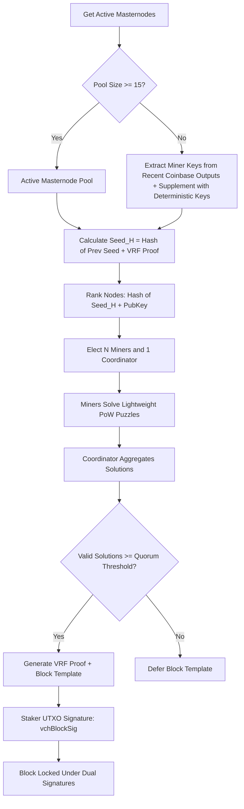

# A Decentralized Approach Model (ADAM) for Solving PoW Puzzles of Blockchains to Decentralize Network Hash Power and Reward Distribution

**Bedri Özgür Güler**  
*bedriguler@gmail.com*  

---

> [!NOTE]  
> *This paper presents the conceptual framework and actual production implementation of the ADAM (A Decentralized Approach Model) consensus mechanism. Originally drafted for Ravencoin's algorithm discussions, the model has been fully implemented and adapted for the KristaTech blockchain.*

---

## Abstract

In this paper, we analyze the source of hash power centralization in Proof-of-Work (PoW) consensus blockchains, where Application-Specific Integrated Circuits (ASICs) and Field-Programmable Gate Arrays (FPGAs) dominate block production. We propose a decentralized approach model (ADAM) that replaces the traditional "hash power race" with a cooperative, distributed problem-solving model. By electing a random pool of miners and a coordinator for each block slot, distributing lightweight parallelized PoW puzzles, and using a sequential hashing chain to generate the block hash, ADAM ensures that building ASICs is economically infeasible. Additionally, we integrate this model with Proof-of-Stake (PoS) to create a secure, dual-signature hybrid consensus topology.

---

## 1. Introduction

Satoshi Nakamoto’s original Bitcoin protocol [1] relies on a competitive race where multiple parties solve a double-SHA256 PoW puzzle. The first party to publish a valid solution receives the block reward. This competitive dynamic inherently rewards scale: the more hash power a miner controls, the higher their probability of winning the block reward. 

This race quickly transitioned from CPUs to GPUs, then to FPGAs, and finally to ASICs. Various projects attempt to design "ASIC-resistant" algorithms by increasing memory requirements or dynamically changing the hashing sequence (e.g., X16R) [2]. However, once a cryptocurrency reaches a high enough valuation, developing custom ASICs becomes highly profitable, leading to the inevitable centralization of network hash power.

Hash power centralization poses severe risks:
1. **51% Attacks**: Single entities or cartels controlling dominant pools can rewrite transaction history.
2. **Economic Exclusion**: Retail miners using commodity hardware (CPUs/GPUs) are priced out, reducing network distribution.
3. **ECOLOGICAL WASTE**: Massive amounts of energy are wasted by competing miners whose solutions are discarded because they did not win the race.

ADAM (A Decentralized Approach Model) solves these problems by replacing the "competitive race" with a **cooperative distribution of hash power and rewards** among randomly selected nodes.

---

## 2. A Decentralized Approach Model (ADAM)

### Motivation
The primary motivation of ADAM is to democratize mining by dividing a complex consensus puzzle into simpler, parallelized partial problems, distributing them to a group of nodes elected by network consensus, and combining their proofs into a single cooperative block validation.

ADAM solves three critical problems:
1. **ASIC Domination**: Because the subset of eligible miners changes randomly for each block, and the required hashing algorithms are dynamically assigned, static ASIC designs cannot achieve a dominant competitive advantage.
2. **Energy Efficiency**: Instead of the entire network racing and wasting electricity, only the elected miners perform work for a given block slot.
3. **Wealth Distribution**: Block rewards are shared among all participants in the cooperative round (the elected miners and the coordinator), achieving an "equal pay for equal work" distribution.

---

## 3. Mathematical Formulation

To bridge the theoretical concept of cooperative problem solving with the actual blockchain code, we present both the abstract operator formulation and its concrete production implementation.

### 3.1. Theoretical Framework (Cryptographic Function Composition)

We define a classical mathematical framework using cryptographic function composition to represent block header states and cooperative hashing operations.

#### 1. Block Header Representation
Let $B(q, s)$ represent the serialized state of a block header, parameterized by the nonce $q$ and the `extraNonce` $s$ in the coinbase transaction (which is cryptographically committed to by the block's Merkle root). For simplicity, we denote the block state as $B$, or $B_k$ when customized for the $k$-th miner.

#### 2. Hashing Operations
Applying a hashing function $H$ (such as SHA-256 or X11) to a block header state is defined as:
$$H(B(q, s)) = \text{hash}(B(q, s)) \in \{0, 1\}^{256}$$
where $H$ can represent a single hashing algorithm or a chained sequence of distinct algorithms.

#### 3. The Theoretical Cooperative Problem
The cooperative validation model divides the target Proof-of-Work (PoW) puzzle into $N$ parallel sub-problems, each solved by an elected miner $i \in \{1, \dots, N\}$:
$$h_i = H_i(C_i(q_i))$$
where:
* $N$ is the size of the elected miner pool.
* $H_i$ is the specific hashing function permuted and assigned to miner $i$.
* $C_i(q_i)$ represents the customized puzzle challenge for miner $i$, incorporating the block's rolling seed, the miner's public key, and their private nonce $q_i$.
* $h_i$ is the lightweight puzzle hash solution computed by miner $i$ below their individual difficulty target.

#### 4. Cryptographic Binding (Chaining Composition)
To bind the block header cryptographically to the work of all elected miners, we define a sequential, non-linear composition function $\mathcal{F}$ over the block header $B$:
$$H_{\text{block}} = \mathcal{F}(B) = \mathcal{H}_N \circ \mathcal{H}_{N-1} \circ \dots \circ \mathcal{H}_1(B)$$
where each step $\mathcal{H}_i$ is a composition function parameterized by the algorithm permutations and coprime multipliers $m_i$ derived from the previous state:
$$\mathcal{H}_i(X) = \left( H_i^{(1)}\left( H_i^{(2)}\left( H_i^{(3)}(X) \times (i + 1) \right) \times (i + 1) \right) \times m_i \right) \pmod{2^{256}}$$
This sequential chaining ensures that the block hash $H_{\text{block}}$ is valid if and only if every single elected miner $i$ has completed their corresponding lightweight PoW puzzle. Altering or omitting any contribution breaks the chain, rendering the final block hash invalid.

---

### 3.2. Implemented Production Mathematics (KristaTech Blockchain)

In a live blockchain database, floating-point representations and sum-of-product hashes are difficult to validate deterministically across distributed nodes. To solve this, the KristaTech production codebase implements the theoretical linear combination using two concrete structures: **Lightweight PoW Puzzles** and a **Stateless Hashing Chain**.

#### 1. Lightweight Puzzle Solving
Each elected miner $i \in \{0, \dots, N-1\}$ must prove they performed work by solving a lightweight puzzle:
$$\text{PuzzleHash}_i = \text{CalculateAdamPuzzleHash}\left(\text{algoIndex}_i, \text{Seed}_H \mathbin{\Vert} \text{MinerPubKey}_i \mathbin{\Vert} \text{Nonce}_i\right)$$
Subject to the target difficulty limit:
$$\text{PuzzleHash}_i \le \text{scaledTarget}$$
where:
* $\text{Seed}_H$ is the rolling VRF seed for the current block height.
* $\text{MinerPubKey}_i$ is the public key of the elected miner.
* The starting difficulty target limit (`powLimit`) is set to `~UINT256_ZERO >> 20` on Mainnet and Testnet (equivalent to `0x1e0ffff0`). This prevents microsecond blocks and consensus splits during genesis bootstrapping.
* $\text{scaledTarget} = \text{Target} \ll \text{activeShift}$. This bit-shift relaxes the difficulty, ensuring the puzzle remains lightweight and solvable within the target block spacing (30 seconds). The value of $\text{activeShift}$ is dynamic based on the block height:
  * $\text{activeShift} = \text{nAdamDifficultyShiftV1}$ (default: `10` or `12`) if block height $< \text{nAdamDifficultyShiftHeight}$ (default: `705`).
  * $\text{activeShift} = \text{nAdamDifficultyShiftV2}$ (default: `6`) if block height $\ge \text{nAdamDifficultyShiftHeight}$ (default: `705`).

The hashing algorithm index ($\text{algoIndex}_i$) is dynamically assigned:
* **Fallback Mode (Version 11)**: $\text{algoIndex}_i = \text{Hash}(\text{Seed}_H \mathbin{\Vert} \text{MinerPubKey}_i) \pmod{18}$, using one of 18 energy-efficient hash functions.
* **Standard Mode (Version 12)**: Uses a 3-permutation selector scheme $\text{GetAdam3PermutationAlgos}(\text{hashPrevBlock}, \text{MinerPubKey}_i)$ that deterministically selects 3 distinct hashing algorithms ($\text{algo1}$, $\text{algo2}$, and $\text{algo3}$) out of 18 available algorithms based on the previous block's hash and the miner's public key. The solver compounds the three algorithms:
  $$\text{PuzzleHash}_i = \text{algo1}\left( (\text{minerIdx} + 1) \times \text{algo2}\left( (\text{minerIdx} + 1) \times \text{algo3}(\text{Challenge}) \right) \right) \pmod{2^{256}}$$

#### 2. Stateless Hashing Chain (Block Hashing)
To bind the block header cryptographically to the work of all elected miners, the block hash ($H_{\text{block}}$) is computed by sequentially chaining the hashing operations of all elected miners. 

For a serialized block header $S$:
1. For each round $i \in \{0, \dots, M-1\}$ (where $M$ is the number of miners), we calculate an odd coprime multiplier $m_i$ to preserve hash entropy:
   $$\text{roundHash}_i = \text{Hash}\left(\text{hashPrevBlock} \mathbin{\Vert} i\right)$$
   $$m_i = \max\left(\text{roundHash}_i[0] \mid 1, 3\right)$$
2. The rounds are chained sequentially:
   - **Round 0**:
     * Derive $\text{algo1}$, $\text{algo2}$, and $\text{algo3}$ for miner $0$.
     * Compute:
       $$H_0^{(3)} = \text{CalculateAdamPuzzleHash}(\text{algo3}, S)$$
       $$H_0^{(2)} = \text{CalculateAdamPuzzleHash}\left(\text{algo2}, \left( H_0^{(3)} \times 1 \right) \pmod{2^{256}}\right)$$
       $$H_0 = \text{CalculateAdamPuzzleHash}\left(\text{algo1}, \left( H_0^{(2)} \times 1 \right) \pmod{2^{256}}\right)$$
     * Apply multiplier:
       $$H_{\text{prev}} = (H_0 \times m_0) \pmod{2^{256}}$$
   - **Round $i > 0$**:
     * Derive $\text{algo1}$, $\text{algo2}$, and $\text{algo3}$ for miner $i$.
     * Compute:
       $$H_i^{(3)} = \text{CalculateAdamPuzzleHash}(\text{algo3}, H_{\text{prev}})$$
       $$H_i^{(2)} = \text{CalculateAdamPuzzleHash}\left(\text{algo2}, \left( H_i^{(3)} \times (i + 1) \right) \pmod{2^{256}}\right)$$
       $$H_i = \text{CalculateAdamPuzzleHash}\left(\text{algo1}, \left( H_i^{(2)} \times (i + 1) \right) \pmod{2^{256}}\right)$$
     * Apply multiplier:
       $$H_{\text{prev}} = (H_i \times m_i) \pmod{2^{256}}$$
3. The final output is the block hash:
   $$H_{\text{block}} = H_{\text{prev}}$$

This sequential, non-linear hashing chain enforces that a block is only valid if it contains the correct mathematical signature of all cooperative mining rounds.

---

## 4. The Implemented Production Pipeline

The consensus flow is structured as a **Cooperative Hybrid Round** with the following pipeline:

### 1. Active Node Pool
The pool of active nodes (`GetAdamMinerPool()`) is derived dynamically from the active, enabled Masternodes on the network and active registered miners:
* **Bilingual Miner Registration**: Nodes can register as miners using one of two methods:
  * **Coin-Lock Registration**: Requires locking at least 1000 KRISTA (`MINER_REGISTRATION_LOCK_AMOUNT = 1000 * COIN`) in a registration output for a lock time of at least `nRegPeriod` blocks.
  * **PoW-Lock Registration**: Requires solving an out-of-band Proof-of-Work challenge mapped to a recent block hash, submitted in a registration output valid for at least `nRegPeriod` blocks.
* **Registration Period (`nRegPeriod`)**: The validity period for miner registration is `2880` blocks on Mainnet, and `2880` blocks on Testnet/Regtest initially (reduced to `100` blocks once the Model D network upgrade is active).
* **Genesis Bootstrapping**: To prevent chain stalls during the early phase when few masternodes or registered miners are active:
  * **Mainnet**: If the block height is $< 704$, the pool automatically registers the public keys of the block producers from blocks 1 to 199.
  * **Testnet**: If the block height is $< 600$, the pool automatically registers the public keys of the block producers from blocks 1 to 199.
* **Regtest**: The pool automatically includes 15 deterministic bootstrap public keys to facilitate automated testing.

### 2. Deterministic Leader Election (SSLE)
For each block height $H$ where the ADAM network upgrade (`Consensus::UPGRADE_ADAM`) is active, the network uses a deterministic single secret leader election (SSLE) algorithm (`SelectAdamNodes`).
* The roll uses a rolling seed:
  $$\text{Seed}_H = \text{Hash}\left(\text{Seed}_{H-1} \mathbin{\Vert} \text{VRFProof}_{H-1}\right)$$
* Each node in the pool is ranked:
  $$\text{Rank}_i = \text{Hash}\left(\text{Seed}_H \mathbin{\Vert} \text{PubKey}_i\right)$$
* Let $T_{\text{active}}$ be the total count of active, enabled masternodes on the network, and $T_{\text{threshold}}$ be the quorum threshold (`nAdamThreshold`, which is `7` on Mainnet/Regtest and `3` on Testnet):
  - **Rule 1 (Masternode-Heavy: $T_{\text{active}} > T_{\text{threshold}}$)**: 
    * Active masternodes are ranked separately: $\text{Rank}_{\text{mn}, i} = \text{Hash}(\text{Seed}_H \mathbin{\Vert} \text{PubKey}_{\text{mn}, i})$.
    * The highest-ranked masternode is elected as the **Coordinator**.
    * The Coordinator is excluded from the general pool.
    * The remaining pool is ranked, and the top $M$ nodes (where $M = \text{nAdamMinersCount} = 11$) are elected as **Miners**.
  - **Rule 2 (Sparse Network: $T_{\text{active}} \le T_{\text{threshold}}$)**:
    * All nodes in the combined pool (masternodes + registered miners) are ranked together: $\text{Rank}_i = \text{Hash}(\text{Seed}_H \mathbin{\Vert} \text{PubKey}_i)$.
    * The top $M$ nodes are elected as **Miners**.
    * The next node in the sorted rank list (at index $M$, or index $0$ if the list is smaller) is elected as the **Coordinator**.

* **Activation Modes**:
  - **Fallback Mode (Block Version 11)**: Active when the `Consensus::UPGRADE_ADAM` network upgrade is active (height 200 on Mainnet/Testnet/Regtest) and the `Consensus::UPGRADE_POMBL` upgrade is inactive. It expects a flexible list of miners (between `nAdamThreshold + 1` and `14` total nodes), with the last miner serving as the Coordinator.
  - **Standard Mode (Block Version 12)**: Active when the `Consensus::UPGRADE_POMBL` network upgrade is active (height 2000 on Mainnet, 400 on Testnet, 300 on Regtest) or when the `SPORK_21_ADAM_STANDARD_MODE` spork is active. It enforces exactly `nAdamMinersCount = 11` miners and 1 distinct Coordinator.

### 3. Solving Phase (Lightweight PoW)
Elected miners solve the lightweight PoW puzzle and broadcast their partial solution over the P2P network. The solution contains:
* `nNonce`: The 32-bit nonce that solves the puzzle.
* `vchSig`: The miner's cryptographic signature on the solved `puzzleHash`, verified using the `VerifyBLSWithECDSAFallback` scheme.

### 4. Orphan Solution Cache
To prevent block assembly stalls caused by network propagation latency, nodes cache solutions received out of order (`mapOrphanAdamSolutions`). When a node receives a puzzle solution for a block height whose predecessor is not yet processed, it holds it in the orphan cache and processes it once the predecessor block is added to the block index.

### 5. Aggregation & Verification Quorum
The Coordinator aggregates the solutions. To prevent sabotage or offline node issues, the network enforces a quorum threshold ($T$):
* **Mainnet & Regtest**: Requires at least `nAdamThreshold = 7` valid solutions from the elected miners.
* **Testnet**: Requires at least `nAdamThreshold = 3` valid solutions.

If the quorum is met, the Coordinator signs the rolling seed to produce `vAdamVRFProof` and signs the final block header (`vAdamCoordinatorSig`) using the hybrid BLS12-381 + ECDSA fallback signature mechanism (`SignBLSWithECDSAFallback`).

### 6. Cooperative Proof-of-Stake (PoS)
At blocks $\ge 200$, the consensus integrates with PoS. The staker's wallet validates the kernel hash difficulty (using the cumulative `CalculateMPAWeight()`). Once a valid staking UTXO is found, the staker's wallet retrieves the elected miners for the current block height via `SelectAdamNodes` and collects the lightweight PoW puzzles solved by these elected miners from the P2P network memory cache (`mapAdamSolutionsCache`). If any solutions are missing, block template generation is deferred. If all solutions are present, the Coordinator generates the VRF proof (`vAdamVRFProof`) and signs the block header (`vAdamCoordinatorSig`) using the hybrid BLS12-381 + ECDSA fallback mechanism. Finally, the staker signs the block using the staking UTXO private key (`vchBlockSig`), locking the block under dual signatures (PoS Block Signature + ADAM Coordinator Signature) to combine the security of both PoS and PoW.

---

## 5. Security Analysis & Mitigations

The production implementation of ADAM in the KristaTech blockchain is hardened against several standard consensus vulnerabilities:

### A. Sybil Attacks
* **Threat**: A malicious actor spins up thousands of cheap virtual private servers (Sybils) to gain a majority of voting power and control leader election.
* **Mitigation**: KristaTech restricts the election pool to active Masternodes with locked collateral. If the active list falls below 15, the network falls back to a deterministic, cryptographically secure keypool. This makes Sybil attacks economically infeasible.

### B. DDoS and Leader Targeting
* **Threat**: If the next block producer's IP address is known beforehand, attackers can DDoS the node to stall the blockchain.
* **Mitigation**: Leaders are elected using the rolling VRF seed. Nodes calculate their election rank locally. Because the seed is updated recursively and signatures are deterministic, the identity of the next leader remains hidden until they publish a signed block header, preventing preemptive targeting.

### C. Sabotage and Network Latency
* **Threat**: Offline miners or network latency prevent the Coordinator from collecting all solutions, halting block production.
* **Mitigation**: The network enforces a quorum threshold defined by the `nAdamThreshold` consensus parameter (configured to `7` on Mainnet/Regtest, and `3` on Testnet) out of `nAdamMinersCount` (configured to `11`) elected miners. As long as the quorum is met, the block is produced. The **Orphan Solution Cache** holds out-of-order solutions, preventing blocks from stalling due to block propagation delays.

### D. Dual Signature Security
* **Threat**: An attacker with 51% PoW or 51% PoS tries to reorganize the blockchain.
* **Mitigation**: Reorganizing the blockchain requires controlling *both* 51% of the staking weight and the private keys of the elected ADAM coordinator and miners. This dual-signature locking makes history reorganization virtually impossible.

---

## 6. Statistical Analysis

We analyze the mining hardware distribution to demonstrate the economic protection against ASICs.

Let:
* $N$ be the total number of mining clients.
* $K$ be the hash rate of a standard GPU client.
* FPGAs be $7 \times$ more efficient than GPUs ($7K$).
* ASICs be $50 \times$ more efficient than GPUs ($50K$).

### Case 1: Competitive Race (Traditional PoW)
If 10% of the network consists of ASICs:
* Total ASIC power: $0.1N \times 50K = 5N K$
* Total GPU power: $0.9N \times K = 0.9N K$
* Ratio of ASIC blocks mined: $\frac{5}{5.9} \approx 84.7\%$

ASIC miners win almost 85% of all block rewards, centralizing the network and forcing GPU miners to leave.

### Case 2: Cooperative Round (ADAM)
In ADAM, only the elected nodes participate. The probability $P_e$ of an ASIC node being elected is proportional to its share of the active Masternode collateral, not its hashing power. 

Once elected, the lightweight puzzle is solved instantly by both GPUs and ASICs (since the target is relaxed by $2^{\text{activeShift}}$). 
* The reward for the block is distributed equally among all $M$ participants.
* The maximum reward an ASIC can earn per block is $\frac{1}{M}$ of the block reward.
* Investing in expensive hashing ASICs yields no additional block rewards, making ASIC development economically unviable.

---

## References

* **[1]** Nakamoto, S. (2008). *Bitcoin: A Peer-to-Peer Electronic Cash System.*
* **[2]** Ravencoin Team. (2018). *X16R Whitepaper.*
