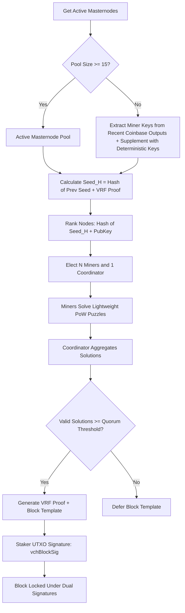

# A Decentralized Approach Model (ADAM) for Solving PoW Puzzles of Blockchains to Decentralize Network Hash Power and Reward Distribution

**Bedri Özgür Güler**  
*bedriguler@gmail.com*  

---

> [!NOTE]  
> *This paper presents the conceptual framework and actual production implementation of the ADAM (A Decentralized Approach Model) consensus mechanism. Originally drafted for Ravencoin's algorithm discussions, the model has been fully implemented and adapted for the KristaTech blockchain.*

---

## Abstract

In this paper, we analyze the source of hash power centralization in Proof-of-Work (PoW) consensus blockchains, where Application-Specific Integrated Circuits (ASICs) and Field-Programmable Gate Arrays (FPGAs) dominate block production. We propose a decentralized approach model (ADAM) that replaces the traditional "hash power race" with a cooperative, distributed problem-solving model. By electing a random pool of miners and a coordinator for each block slot, distributing lightweight parallelized PoW puzzles, and using a sequential hashing chain to generate the block hash, ADAM ensures that building ASICs is economically infeasible. Additionally, we integrate this model with Proof-of-Stake (PoS) to create a secure, dual-signature hybrid consensus topology.

---

## 1. Introduction

Satoshi Nakamoto’s original Bitcoin protocol [1] relies on a competitive race where multiple parties solve a double-SHA256 PoW puzzle. The first party to publish a valid solution receives the block reward. This competitive dynamic inherently rewards scale: the more hash power a miner controls, the higher their probability of winning the block reward. 

This race quickly transitioned from CPUs to GPUs, then to FPGAs, and finally to ASICs. Various projects attempt to design "ASIC-resistant" algorithms by increasing memory requirements or dynamically changing the hashing sequence (e.g., X16R) [2]. However, once a cryptocurrency reaches a high enough valuation, developing custom ASICs becomes highly profitable, leading to the inevitable centralization of network hash power.

Hash power centralization poses severe risks:
1. **51% Attacks**: Single entities or cartels controlling dominant pools can rewrite transaction history.
2. **Economic Exclusion**: Retail miners using commodity hardware (CPUs/GPUs) are priced out, reducing network distribution.
3. **ECOLOGICAL WASTE**: Massive amounts of energy are wasted by competing miners whose solutions are discarded because they did not win the race.

ADAM (A Decentralized Approach Model) solves these problems by replacing the "competitive race" with a **cooperative distribution of hash power and rewards** among randomly selected nodes.

---

## 2. A Decentralized Approach Model (ADAM)

### Motivation
The primary motivation of ADAM is to democratize mining by dividing a complex consensus puzzle into simpler, parallelized partial problems, distributing them to a group of nodes elected by network consensus, and combining their proofs into a single cooperative block validation.

ADAM solves three critical problems:
1. **ASIC Domination**: Because the subset of eligible miners changes randomly for each block, and the required hashing algorithms are dynamically assigned, static ASIC designs cannot achieve a dominant competitive advantage.
2. **Energy Efficiency**: Instead of the entire network racing and wasting electricity, only the elected miners perform work for a given block slot.
3. **Wealth Distribution**: Block rewards are shared among all participants in the cooperative round (the elected miners and the coordinator), achieving an "equal pay for equal work" distribution.

---

## 3. Mathematical Formulation

To bridge the theoretical concept of cooperative problem solving with the actual blockchain code, we present both the abstract operator formulation and its concrete production implementation.

### 3.1. Theoretical Framework (Dirac Bra-Ket Notation)

We utilize a modified Dirac bra-ket notation [3] to represent block header states and hashing operations.

#### 1. Block Header State
Let $|B(q, s)\rangle$ represent the state of a block header, where $q$ is the nonce and $s$ is the `extraNonce` in the coinbase transaction. The state depends explicitly on $q$ and implicitly on $s$ via the Merkle root. For simplicity, we denote these states as $|B\rangle$, or $|B_k\rangle$ for the $k$-th miner.

#### 2. Hashing Function Operator (HFO)
Let $H$ be a Hashing Function Operator. Applying $H$ to a block state yields a hash:
$$H|B(q, s)\rangle = \text{hash}(B(q, s))$$
$H$ can represent a single algorithm (e.g., $H_{\text{sha256}}$) or a chained sequence of different algorithms.

#### 3. Conjugate State
Define the conjugate state $\langle B(s, q)|$ such that:
$$\langle B_j | H_j^\dagger H_k | B_k \rangle = \text{hash}_j(B_j) \cdot \text{hash}_k(B_k)$$

#### 4. The Theoretical Complete Problem
The theoretical cooperative puzzle is defined as a linear combination of $N$ simpler, parallelized partial puzzles:
$$H_c |B_c\rangle = \sum_{k=1}^N P_k H_k |B_k\rangle$$
where:
* $N$ is the size of the elected miner pool.
* $H(c)$ is the complex complete operator.
* $P(k)$ represents the contribution or probability weight of the $k$-th miner ($0 \le P(k) \le 1$).
* $H(k) |B(k)\rangle$ is the $k$-th partial puzzle solved by the $k$-th elected miner.

Evaluating the overall difficulty target of the combined state involves calculating the norm of the linear combination:
$$\langle B_c | H_c^\dagger H_c | B_c \rangle = \sum_{k=1}^N \sum_{j=1}^N P_k P_j \langle B_k | H_k^\dagger H_j | B_j \rangle$$
This equation contains cross-terms representing the cooperative cryptographic binding between all participating miners.

---

### 3.2. Implemented Production Mathematics (KristaTech Blockchain)

In a live blockchain database, floating-point representations and sum-of-product hashes are difficult to validate deterministically across distributed nodes. To solve this, the KristaTech production codebase implements the theoretical linear combination using two concrete structures: **Lightweight PoW Puzzles** and a **Stateless Hashing Chain**.

#### 1. Lightweight Puzzle Solving
Each elected miner $i \in \{0, \dots, N-1\}$ must prove they performed work by solving a lightweight puzzle:
$$\text{PuzzleHash}_i = \text{CalculateAdamPuzzleHash}\left(\text{algoIndex}_i, \text{Seed}_H \mathbin{\Vert} \text{MinerPubKey}_i \mathbin{\Vert} \text{Nonce}_i\right)$$
Subject to the target difficulty limit:
$$\text{PuzzleHash}_i \le \text{scaledTarget}$$
where:
* $\text{Seed}_H$ is the rolling VRF seed for the current block height.
* $\text{MinerPubKey}_i$ is the public key of the elected miner.
* $\text{scaledTarget} = \text{Target} \ll 12$. This bit-shift relaxes the difficulty, ensuring the puzzle remains lightweight and solvable within the target block spacing (30 seconds).

The hashing algorithm index ($\text{algoIndex}_i$) is dynamically assigned:
* **Fallback Mode (Version 11)**: $\text{algoIndex}_i = \text{Hash}(\text{Seed}_H \mathbin{\Vert} \text{MinerPubKey}_i) \pmod{18}$, using one of 18 energy-efficient hash functions.
* **Standard Mode (Version 12)**: $\text{algoIndex}_i = i \pmod{13}$, rotating through 13 standard hash functions.

#### 2. Stateless Hashing Chain (Block Hashing)
To bind the block header cryptographically to the work of all elected miners, the block hash ($H_{\text{block}}$) is computed by sequentially chaining the hashing operations of all elected miners. 

For a serialized block header $S$:
1. For each round $i \in \{0, \dots, M-1\}$ (where $M$ is the number of miners), we calculate an odd coprime multiplier $m_i$ to preserve hash entropy:
   $$\text{roundHash}_i = \text{Hash}\left(\text{hashPrevBlock} \mathbin{\Vert} i\right)$$
   $$m_i = \max\left(\text{roundHash}_i[0] \mid 1, 3\right)$$
2. The rounds are chained sequentially:
   - **Round 0**: 
     $$H_0 = \text{CalculateAdamPuzzleHash}(\text{algo}_0, S) \times m_0 \pmod{2^{256}}$$
   - **Round $i > 0$**: 
     $$H_i = \text{CalculateAdamPuzzleHash}(\text{algo}_i, H_{i-1}) \times m_i \pmod{2^{256}}$$
3. The final output is the block hash:
   $$H_{\text{block}} = H_{M-1}$$

This sequential, non-linear hashing chain enforces that a block is only valid if it contains the correct mathematical signature of all cooperative mining rounds.

---

## 4. The Implemented Production Pipeline

The consensus flow is structured as a **Cooperative Hybrid Round** with the following pipeline:

### 1. Active Node Pool
The pool of active nodes (`GetAdamMinerPool()`) is derived dynamically from the active, enabled Masternodes on the network and active registered miners (via Coin-Lock or PoW-Lock). On Mainnet and Testnet, this pool is dynamically constructed from these active Masternodes and active registered miners. On Regtest, the pool automatically includes 15 deterministic bootstrap public keys to facilitate automated testing.

### 2. Deterministic Leader Election (SSLE)
For each block height $H$ where the ADAM network upgrade (`Consensus::UPGRADE_ADAM`) is active, the network uses a deterministic single secret leader election (SSLE) algorithm (`SelectAdamNodes`).
* The roll uses a rolling seed:
  $$\text{Seed}_H = \text{Hash}\left(\text{Seed}_{H-1} \mathbin{\Vert} \text{VRFProof}_{H-1}\right)$$
* Each node in the pool is ranked:
  $$\text{Rank}_i = \text{Hash}\left(\text{Seed}_H \mathbin{\Vert} \text{PubKey}_i\right)$$
* The sorted list determines the elected nodes:
  - **Fallback Mode (Block Version 11)**: Activates when the `Consensus::UPGRADE_ADAM` network upgrade is active (height 200 on Mainnet, 200 on Testnet, 200 on Regtest) and the `Consensus::UPGRADE_POMBL` upgrade is inactive. It elects between 11 and 14 miners, with the last miner serving as the Coordinator.
  - **Standard Mode (Block Version 12)**: Activates when the `Consensus::UPGRADE_POMBL` network upgrade is active (height 2000 on Mainnet, 2000 on Testnet, 300 on Regtest) or when the `SPORK_21_ADAM_STANDARD_MODE` spork is active. It elects a pool of miners whose size is defined by the consensus parameter `nAdamMinersCount` (configured to `11` in the codebase) and 1 distinct Coordinator.

### 3. Solving Phase (Lightweight PoW)
Elected miners solve the lightweight PoW puzzle and broadcast their partial solution (containing the nonce and miner signature) over the P2P network.

### 4. Orphan Solution Cache
To prevent block assembly stalls caused by network propagation latency, nodes cache solutions received out of order (`mapOrphanAdamSolutions`). When a node receives a puzzle solution for a block height whose predecessor is not yet processed, it holds it in the orphan cache and processes it once the predecessor block is added to the block index.

### 5. Aggregation & Verification Quorum
The Coordinator aggregates the solutions. To prevent sabotage or offline node issues, the network enforces a quorum threshold ($T$):
* **Version 11 (Fallback Mode)**: Requires at least the quorum defined by the `nAdamThreshold` consensus parameter (configured to `7` in the codebase) from the elected miners.
* **Version 12 (Standard Mode)**: Requires at least the quorum defined by the `nAdamThreshold` consensus parameter (configured to `7` in the codebase) from the elected miners.

If the quorum is met, the Coordinator signs the rolling seed to produce `vAdamVRFProof` and signs the final block header (`vAdamCoordinatorSig`).

### 6. Cooperative Proof-of-Stake (PoS)
At blocks $\ge 200$, the consensus integrates with PoS. The staker's wallet validates the kernel hash difficulty (using the cumulative `CalculateMPAWeight()`). Once a valid staking UTXO is found, the staker's wallet retrieves the elected miners for the current block height via `SelectAdamNodes` and collects the lightweight PoW puzzles solved by these elected miners from the P2P network memory cache (`mapAdamSolutionsCache`). If any solutions are missing, block template generation is deferred. If all solutions are present, the Coordinator generates the VRF proof (`vAdamVRFProof`) and signs the block header (`vAdamCoordinatorSig`). Finally, the staker signs the block using the staking UTXO private key (`vchBlockSig`), locking the block under dual signatures (PoS Block Signature + ADAM Coordinator Signature) to combine the security of both PoS and PoW.

---

## 5. Security Analysis & Mitigations

The production implementation of ADAM in the KristaTech blockchain is hardened against several standard consensus vulnerabilities:

### A. Sybil Attacks
* **Threat**: A malicious actor spins up thousands of cheap virtual private servers (Sybils) to gain a majority of voting power and control leader election.
* **Mitigation**: KristaTech restricts the election pool to active Masternodes with locked collateral. If the active list falls below 15, the network falls back to a deterministic, cryptographically secure keypool. This makes Sybil attacks economically infeasible.

### B. DDoS and Leader Targeting
* **Threat**: If the next block producer's IP address is known beforehand, attackers can DDoS the node to stall the blockchain.
* **Mitigation**: Leaders are elected using the rolling VRF seed. Nodes calculate their election rank locally. Because the seed is updated recursively and signatures are deterministic, the identity of the next leader remains hidden until they publish a signed block header, preventing preemptive targeting.

### C. Sabotage and Network Latency
* **Threat**: Offline miners or network latency prevent the Coordinator from collecting all solutions, halting block production.
* **Mitigation**: The network enforces a quorum threshold defined by the `nAdamThreshold` consensus parameter (configured to `7`) out of `nAdamMinersCount` (configured to `11`) elected miners. As long as the quorum is met, the block is produced. The **Orphan Solution Cache** holds out-of-order solutions, preventing blocks from stalling due to block propagation delays.

### D. Dual Signature Security
* **Threat**: An attacker with 51% PoW or 51% PoS tries to reorganize the blockchain.
* **Mitigation**: Reorganizing the blockchain requires controlling *both* 51% of the staking weight and the private keys of the elected ADAM coordinator and miners. This dual-signature locking makes history reorganization virtually impossible.

---

## 6. Statistical Analysis

We analyze the mining hardware distribution to demonstrate the economic protection against ASICs.

Let:
* $N$ be the total number of mining clients.
* $K$ be the hash rate of a standard GPU client.
* FPGAs be $7 \times$ more efficient than GPUs ($7K$).
* ASICs be $50 \times$ more efficient than GPUs ($50K$).

### Case 1: Competitive Race (Traditional PoW)
If 10% of the network consists of ASICs:
* Total ASIC power: $0.1N \times 50K = 5N K$
* Total GPU power: $0.9N \times K = 0.9N K$
* Ratio of ASIC blocks mined: $\frac{5}{5.9} \approx 84.7\%$

ASIC miners win almost 85% of all block rewards, centralizing the network and forcing GPU miners to leave.

### Case 2: Cooperative Round (ADAM)
In ADAM, only the elected nodes participate. The probability $P_e$ of an ASIC node being elected is proportional to its share of the active Masternode collateral, not its hashing power. 

Once elected, the lightweight puzzle is solved instantly by both GPUs and ASICs (since the target is relaxed by $2^{12}$). 
* The reward for the block is distributed equally among all $M$ participants.
* The maximum reward an ASIC can earn per block is $\frac{1}{M}$ of the block reward.
* Investing in expensive hashing ASICs yields no additional block rewards, making ASIC development economically unviable.

---

## References

* **[1]** Nakamoto, S. (2008). *Bitcoin: A Peer-to-Peer Electronic Cash System.*
* **[2]** Ravencoin Team. (2018). *X16R Whitepaper.*
* **[3]** Dirac, P. A. M. (1939). *A New Notation for Quantum Mechanics.*