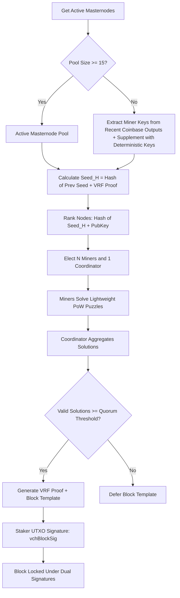

# Ağ Hash Gücünü ve Ödül Dağıtımını Merkeziyetsizleştirmek İçin Blokzincirlerinin PoW Bulmacalarını Çözmeye Yönelik Merkeziyetsiz Bir Yaklaşım Modeli (ADAM)

**Bedri Özgür Güler**  
*bedriguler@gmail.com*  

---

> [!NOTE]  
> *Bu makale, ADAM (A Decentralized Approach Model - Merkeziyetsiz Bir Yaklaşım Modeli) mutabakat mekanizmasının kavramsal çerçevesini ve gerçek üretim uygulamasını sunmaktadır. Aslen Ravencoin'in algoritma tartışmaları için tasarlanan model, KristaTech blokzinciri için tamamen uygulanmış ve uyarlanmıştır.*

---

## Özet

Bu makalede, Özel Entegre Devrelerin (ASIC'ler) ve Alanda Programlanabilir Kapı Dizilerinin (FPGA'ler) blok üretimini domine ettiği Proof-of-Work (PoW) mutabakatlı blokzincirlerindeki hash gücü merkezileşmesinin kaynağını analiz ediyoruz. Geleneksel "hash gücü yarışı" yerine iş birlikçi, dağıtık bir problem çözme modeli koyan merkeziyetsiz bir yaklaşım modeli (ADAM) öneriyoruz. Her blok yuvası için rastgele bir madenci havuzu ve bir koordinatör seçerek, hafif paralelleştirilmiş PoW bulmacaları dağıtarak ve blok hash'ini oluşturmak için sıralı bir hashing zinciri kullanarak ADAM, ASIC üretmenin ekonomik olarak fizibil olmamasını sağlar. Ek olarak, güvenli ve çift imzalı hibrit bir mutabakat topolojisi oluşturmak için bu modeli Proof-of-Stake (PoS) ile entegre ediyoruz.

---

## 1. Giriş

Satoshi Nakamoto’nun orijinal Bitcoin protokolü [1], birden fazla tarafın çift-SHA256 PoW bulmacasını çözmek için yarıştığı rekabetçi bir mücadeleye dayanır. Geçerli bir çözümü ilk yayınlayan taraf blok ödülünü alır. Bu rekabetçi dinamik doğası gereği ölçeği ödüllendirir: Bir madenci ne kadar çok hash gücü kontrol ederse, blok ödülünü kazanma olasılığı o kadar yüksek olur. 

Bu yarış hızlı bir şekilde CPU'lardan GPU'lara, ardından FPGA'lere ve nihayetinde ASIC'lere geçti. Çeşitli projeler, bellek gereksinimlerini artırarak veya hashing sırasını dinamik olarak değiştirerek (örneğin X16R) [2] "ASIC-dirençli" algoritmalar tasarlamaya çalışmaktadır. Ancak, bir kripto para birimi yeterince yüksek bir piyasa değerine ulaştığında, özel ASIC'ler geliştirmek son derece karlı hale gelir ve bu da ağ hash gücünün kaçınılmaz olarak merkezileşmesine yol açar.

Hash gücü merkezileşmesi ciddi riskler barındırır:
1. **%51 Saldırıları**: Dominant havuzları kontrol eden tekil kuruluşlar veya karteller işlem geçmişini yeniden yazabilir.
2. **Ekonomik Dışlanma**: Standart donanımlar (CPU'lar/GPU'lar) kullanan bireysel madenciler sistem dışına itilir ve bu da ağ dağılımını azaltır.
3. **EKOLOJİK ATIK**: Yarışı kazanamadıkları için çözümleri çöpe atılan rakip madenciler tarafından muazzam miktarda enerji israf edilir.

ADAM (A Decentralized Approach Model), "rekabetçi yarış" yerine, rastgele seçilen düğümler arasında **hash gücünün ve ödüllerin iş birlikçi bir şekilde dağıtılmasını** koyarak bu sorunları çözer.

---

## 2. Merkeziyetsiz Bir Yaklaşım Modeli (ADAM)

### Motivasyon
ADAM'ın temel motivasyonu; karmaşık bir mutabakat bulmacasını daha basit, paralelleştirilmiş kısmi problemlere bölerek, bunları ağ mutabakatı tarafından seçilen bir grup düğüme dağıtarak ve kanıtlarını tek bir iş birlikçi blok doğrulaması halinde birleştirerek madenciliği demokratikleştirmektir.

ADAM üç kritik sorunu çözer:
1. **ASIC Dominasyonu**: Uygun madencilerin alt kümesi her blok için rastgele değiştiğinden ve gerekli hashing algoritmaları dinamik olarak atandığından, statik ASIC tasarımları baskın bir rekabet avantajı elde edemez.
2. **Enerji Verimliliği**: Tüm ağın yarışıp elektrik israf etmesi yerine, yalnızca seçilen madenciler belirli bir blok yuvası için iş yapar.
3. **Refah Dağıtımı**: Blok ödülleri, iş birlikçi tura katılan tüm katılımcılar (seçilen madenciler ve koordinatör) arasında paylaştırılarak "eşit işe eşit ücret" dağıtımı sağlanır.

---

## 3. Matematiksel Formülasyon

İş birlikçi problem çözmenin teorik kavramı ile gerçek blokzinciri kodu arasında köprü kurmak için hem soyut operatör formülasyonunu hem de somut üretim uygulamasını sunuyoruz.

### 3.1. Teorik Çerçeve (Dirac Bra-Ket Gösterimi)

Blok başlığı (block header) durumlarını ve hashing işlemlerini temsil etmek için modifiye edilmiş bir Dirac bra-ket gösterimi [3] kullanıyoruz.

#### 1. Blok Başlığı Durumu
$|B(q, s)\rangle$, bir blok başlığının durumunu temsil etsin; burada $q$ nonce değeri ve $s$ ise coinbase işlemindeki `extraNonce` değeridir. Durum, açıkça $q$'ya ve Merkle kökü aracılığıyla örtük olarak $s$'ye bağlıdır. Basitlik adına, bu durumları $|B\rangle$ veya $k$. madenci için $|B_k\rangle$ olarak gösteriyoruz.

#### 2. Hashing Function Operator (HFO)
$H$, bir Hashing Function Operator (Özetleme Fonksiyonu Operatörü) olsun. $H$ operatörünü bir blok durumuna uygulamak bir hash verir:
$$H|B(q, s)\rangle = \text{hash}(B(q, s))$$
$H$, tek bir algoritmayı (örneğin $H_{\text{sha256}}$) veya farklı algoritmaların zincirlenmiş bir dizisini temsil edebilir.

#### 3. Eşlenik Durum
Eşlenik durum $\langle B(s, q)|$'yu şu şekilde tanımlayın:
$$\langle B_j | H_j^\dagger H_k | B_k \rangle = \text{hash}_j(B_j) \cdot \text{hash}_k(B_k)$$

#### 4. Teorik Tam Problem
Teorik iş birlikçi bulmaca, $N$ adet daha basit, paralelleştirilmiş kısmi bulmacanın lineer bir kombinasyonu olarak tanımlanır:
$$H_c |B_c\rangle = \sum_{k=1}^N P_k H_k |B_k\rangle$$
burada:
* $N$, seçilen madenci havuzunun boyutudur.
* $H(c)$ karmaşık tam operatördür.
* $P(k)$, $k$. madencinin katkısını veya olasılık ağırlığını temsil eder ($0 \le P(k) \le 1$).
* $H(k) |B(k)\rangle$, $k$. seçilen madenci tarafından çözülen $k$. kısmi bulmacadır.

Birleşik durumun genel zorluk hedefini değerlendirmek, lineer kombinasyonun normunun hesaplanmasını içerir:
$$\langle B_c | H_c^\dagger H_c | B_c \rangle = \sum_{k=1}^N \sum_{j=1}^N P_k P_j \langle B_k | H_k^\dagger H_j | B_j \rangle$$
Bu denklem, katılan tüm madenciler arasındaki iş birlikçi kriptografik bağları temsil eden çapraz terimler içerir.

---

### 3.2. Uygulanan Üretim Matematiği (KristaTech Blokzinciri)

Canlı bir blokzinciri veritabanında, kayan noktalı (floating-point) gösterimleri ve çarpımların toplamı şeklindeki hash'leri dağıtık düğümler arasında deterministik olarak doğrulamak zordur. Bunu çözmek için KristaTech üretim kod tabanı, teorik lineer kombinasyonu iki somut yapı kullanarak uygular: **Hafif PoW Bulmacaları (Lightweight PoW Puzzles)** ve **Durumsuz Hashing Zinciri (Stateless Hashing Chain)**.

#### 1. Hafif Bulmaca Çözme (Lightweight Puzzle Solving)
Seçilen her $i \in \{0, \dots, N-1\}$ madencisi, hafif bir bulmacayı çözerek iş yaptıklarını kanıtlamalıdır:
$$\text{PuzzleHash}_i = \text{CalculateAdamPuzzleHash}\left(\text{algoIndex}_i, \text{Seed}_H \mathbin{\Vert} \text{MinerPubKey}_i \mathbin{\Vert} \text{Nonce}_i\right)$$
Aşağıdaki hedef zorluk sınırına tabi olarak:
$$\text{PuzzleHash}_i \le \text{scaledTarget}$$
burada:
* $\text{Seed}_H$, mevcut blok yüksekliği için sürekli güncellenen (rolling) VRF tohumudur (seed).
* $\text{MinerPubKey}_i$, seçilen madencinin açık anahtarıdır.
* Başlangıç zorluk hedef sınırı (`powLimit`), Mainnet ve Testnet üzerinde `~UINT256_ZERO >> 20` (veya `0x1e0ffff0` değerine eşdeğer) olarak ayarlanmıştır. Bu, genesis başlangıç aşaması (bootstrapping) sırasında mikrosaniyelik blokları ve mutabakat bölünmelerini önler.
* $\text{scaledTarget} = \text{Target} \ll \text{activeShift}$. Bu bit kaydırma işlemi (bit-shift) zorluğu gevşeterek, bulmacanın hafif kalmasını ve hedef blok süresi (30 saniye) içinde çözülebilir olmasını sağlar. $\text{activeShift}$ değeri, blok yüksekliğine bağlı olarak dinamiktir:
  * Blok yüksekliği $< \text{nAdamDifficultyShiftHeight}$ (varsayılan: `705`) ise $\text{activeShift} = \text{nAdamDifficultyShiftV1}$ (varsayılan: `10` veya `12`).
  * Blok yüksekliği $\ge \text{nAdamDifficultyShiftHeight}$ (varsayılan: `705`) ise $\text{activeShift} = \text{nAdamDifficultyShiftV2}$ (varsayılan: `6`).

Hashing algoritması indeksi ($\text{algoIndex}_i$) dinamik olarak atanır:
* **Geri Çekilme Modu (Fallback Mode - Sürüm 11)**: $\text{algoIndex}_i = \text{Hash}(\text{Seed}_H \mathbin{\Vert} \text{MinerPubKey}_i) \pmod{18}$, enerji tasarruflu 18 hash fonksiyonundan birini kullanır.
* **Standart Mod (Sürüm 12)**: Önceki bloğun hash'ine ve madencinin açık anahtarına dayanarak, mevcut 18 algoritma arasından deterministik olarak 3 farklı hashing algoritmasını ($\text{algo1}$, $\text{algo2}$ ve $\text{algo3}$) seçen 3-permütasyonlu bir seçici şema $\text{GetAdam3PermutationAlgos}(\text{hashPrevBlock}, \text{MinerPubKey}_i)$ kullanır. Çözücü bu üç algoritmayı birleştirir:
  $$\text{PuzzleHash}_i = \text{algo1}\left( (\text{minerIdx} + 1) \times \text{algo2}\left( (\text{minerIdx} + 1) \times \text{algo3}(\text{Challenge}) \right) \right) \pmod{2^{256}}$$

#### 2. Durumsuz Hashing Zinciri (Blok Hashing)
Blok başlığını, seçilen tüm madencilerin işlerine kriptografik olarak bağlamak için, blok hash'i ($H_{\text{block}}$), seçilen tüm madencilerin hashing işlemlerini sıralı olarak zincirleyerek hesaplanır. 

Serileştirilmiş bir blok başlığı $S$ için:
1. Her $i \in \{0, \dots, M-1\}$ turu için (burada $M$ madenci sayısıdır), hash entropisini korumak için tek bir aralarında asal çarpan $m_i$ hesaplarız:
   $$\text{roundHash}_i = \text{Hash}\left(\text{hashPrevBlock} \mathbin{\Vert} i\right)$$
   $$m_i = \max\left(\text{roundHash}_i[0] \mid 1, 3\right)$$
2. Turlar sıralı olarak zincirlenir:
   - **Tur 0**:
     * Madenci 0 için $\text{algo1}$, $\text{algo2}$ ve $\text{algo3}$ türetilir.
     * Hesaplama:
       $$H_0^{(3)} = \text{CalculateAdamPuzzleHash}(\text{algo3}, S)$$
       $$H_0^{(2)} = \text{CalculateAdamPuzzleHash}\left(\text{algo2}, \left( H_0^{(3)} \times 1 \right) \pmod{2^{256}}\right)$$
       $$H_0 = \text{CalculateAdamPuzzleHash}\left(\text{algo1}, \left( H_0^{(2)} \times 1 \right) \pmod{2^{256}}\right)$$
     * Çarpanı uygula:
       $$H_{\text{prev}} = (H_0 \times m_0) \pmod{2^{256}}$$
   - **Tur $i > 0$**:
     * Madenci $i$ için $\text{algo1}$, $\text{algo2}$ ve $\text{algo3}$ türetilir.
     * Hesaplama:
       $$H_i^{(3)} = \text{CalculateAdamPuzzleHash}(\text{algo3}, H_{\text{prev}})$$
       $$H_i^{(2)} = \text{CalculateAdamPuzzleHash}\left(\text{algo2}, \left( H_i^{(3)} \times (i + 1) \right) \pmod{2^{256}}\right)$$
       $$H_i = \text{CalculateAdamPuzzleHash}\left(\text{algo1}, \left( H_i^{(2)} \times (i + 1) \right) \pmod{2^{256}}\right)$$
     * Çarpanı uygula:
       $$H_{\text{prev}} = (H_i \times m_i) \pmod{2^{256}}$$
3. Nihai çıktı blok hash'idir:
   $$H_{\text{block}} = H_{\text{prev}}$$

Bu sıralı, lineer olmayan hashing zinciri, bir bloğun yalnızca katılan tüm iş birlikçi madencilik turlarının doğru matematiksel imzasını içermesi durumunda geçerli olmasını zorunlu kılar.

---

## 4. Uygulanan Üretim İşlem Yolu (Pipeline)

Mutabakat akışı, aşağıdaki işlem yoluna sahip bir **İş Birlikçi Hibrit Tur (Cooperative Hybrid Round)** olarak yapılandırılmıştır:

### 1. Aktif Düğüm Havuzu (Active Node Pool)
Aktif düğümlerin havuzu (`GetAdamMinerPool()`), ağdaki aktif ve etkinleştirilmiş Masternode'lardan ve aktif kayıtlı madencilerden (Coin-Lock veya PoW-Lock aracılığıyla) dinamik olarak türetilir.
* **Mainnet ve Testnet**: Aktif Masternode'lardan ve kayıtlı madencilerden oluşturulur. Erken başlangıç aşamasında zincirin durmasını önlemek için, mevcut blok yüksekliği Mainnet'te $< 704$ (veya Testnet'te $< 5000$) ise havuz, 1 ila 199. bloklar arasındaki blok üreticilerinin açık anahtarlarını otomatik olarak kaydeder.
* **Regtest**: Havuz, otomatik testleri kolaylaştırmak amacıyla otomatik olarak 15 deterministik başlangıç (bootstrap) açık anahtarını içerir.

### 2. Deterministik Lider Seçimi (SSLE)
ADAM ağ yükseltmesinin (`Consensus::UPGRADE_ADAM`) aktif olduğu her $H$ blok yüksekliği için ağ, deterministik bir tekli gizli lider seçimi (SSLE) algoritması (`SelectAdamNodes`) kullanır.
* Seçim işlemi sürekli güncellenen bir tohum (rolling seed) kullanır:
  $$\text{Seed}_H = \text{Hash}\left(\text{Seed}_{H-1} \mathbin{\Vert} \text{VRFProof}_{H-1}\right)$$
* Havuzdaki her düğüm sıralanır:
  $$\text{Rank}_i = \text{Hash}\left(\text{Seed}_H \mathbin{\Vert} \text{PubKey}_i\right)$$
* Sıralanmış liste, seçilen düğümleri belirler:
  - **Geri Çekilme Modu (Fallback Mode - Blok Sürümü 11)**: `Consensus::UPGRADE_ADAM` ağ yükseltmesi aktif olduğunda (Mainnet'te 200, Testnet'te 200, Regtest'te 200 yüksekliğinde) ve `Consensus::UPGRADE_POMBL` yükseltmesi aktif olmadığında etkinleşir. Son madenci Koordinatör (Coordinator) olarak hizmet etmek üzere 11 ila 14 madenci seçer.
  - **Standart Mod (Blok Sürümü 12)**: `Consensus::UPGRADE_POMBL` ağ yükseltmesi aktif olduğunda (Mainnet'te 2000, Testnet'te 400, Regtest'te 300 yüksekliğinde) veya `SPORK_21_ADAM_STANDARD_MODE` spork'u aktif olduğunda etkinleşir. Boyutu `nAdamMinersCount` mutabakat parametresi ile tanımlanan (kod tabanında `11` olarak yapılandırılmıştır) bir madenci havuzu ve 1 farklı Koordinatör seçer.

### 3. Çözüm Aşaması (Hafif PoW)
Seçilen madenciler hafif PoW bulmacasını çözer ve kısmi çözümlerini (nonce ve madenci imzasını içeren) P2P ağı üzerinden yayınlar (broadcast).

### 4. Yetim Çözüm Önbelleği (Orphan Solution Cache)
Ağ yayılım gecikmesinin neden olduğu blok birleştirme durmalarını önlemek için düğümler, sırasız alınan çözümleri önbelleğe alır (`mapOrphanAdamSolutions`). Bir düğüm, önceli henüz işlenmemiş bir blok yüksekliği için bir bulmaca çözümü aldığında, bunu yetim önbelleğinde tutar ve öncel blok blok dizinine eklendiğinde işler.

### 5. Birleştirme ve Doğrulama Çoğunluğu (Quorum)
Koordinatör çözümleri birleştirir. Sabotajı veya çevrimdışı düğüm sorunlarını önlemek için ağ, seçilen madencilerden bir çoğunluk eşiği ($T$) zorunlu kılar:
* **Sürüm 11 (Geri Çekilme Modu)**: Seçilen madencilerden en az `nAdamThreshold` mutabakat parametresi (Mainnet/Regtest üzerinde `7`, Testnet üzerinde `3` olarak yapılandırılmıştır) ile tanımlanan çoğunluğu gerektirir.
* **Sürüm 12 (Standart Mod)**: Seçilen madencilerden en az `nAdamThreshold` mutabakat parametresi (Mainnet/Regtest üzerinde `7`, Testnet üzerinde `3` olarak yapılandırılmıştır) ile tanımlanan çoğunluğu gerektirir.

Çoğunluk sağlanırsa Koordinatör, sürekli güncellenen tohumu imzalayarak `vAdamVRFProof` üretir ve hibrit BLS12-381 + ECDSA geri çekilme imza mekanizmasını (`SignBLSWithECDSAFallback`) kullanarak nihai blok başlığını imzalar (`vAdamCoordinatorSig`). Bu şema altında Koordinatör, kendi ECDSA gizli anahtarından türetilen bir BLS12-381 anahtarını kullanarak imza atar ve açık anahtarını kendi ECDSA anahtarıyla imzalayarak BLS anahtarını yetkilendirir.

### 6. İş Birlikçi Proof-of-Stake (PoS)
$\ge 200$ bloklarında mutabakat PoS ile entegre olur. Staker'ın cüzdanı, çekirdek (kernel) hash zorluğunu doğrular (kümülatif `CalculateMPAWeight()` kullanarak). Geçerli bir staking UTXO'su bulunduğunda, staker'ın cüzdanı `SelectAdamNodes` aracılığıyla mevcut blok yüksekliği için seçilen madencileri alır ve bu seçilen madenciler tarafından çözülen hafif PoW bulmacalarını P2P ağı bellek önbelleğinden (`mapAdamSolutionsCache`) toplar. Herhangi bir çözüm eksikse, blok şablonu üretimi ertelenir. Tüm çözümler mevcutsa, Koordinatör VRF kanıtını (`vAdamVRFProof`) oluşturur ve hibrit BLS12-381 + ECDSA geri çekilme mekanizmasını kullanarak blok başlığını imzalar (`vAdamCoordinatorSig`). Son olarak staker, staking UTXO gizli anahtarını (`vchBlockSig`) kullanarak bloğu imzalar; böylece hem PoS hem de PoW güvenliğini birleştirmek için bloğu çift imza (PoS Blok İmzası + ADAM Koordinatör İmzası) altında kilitler.

---

## 5. Güvenlik Analizi ve Önlemler

ADAM'ın KristaTech blokzincirindeki üretim uygulaması, birkaç standart mutabakat güvenlik açığına karşı sağlamlaştırılmıştır:

### A. Sybil Saldırıları
* **Tehdit**: Kötü niyetli bir aktör, oy gücünün çoğunluğunu elde etmek ve lider seçimini kontrol etmek için binlerce ucuz sanal özel sunucu (Sybil) kurar.
* **Önlem**: KristaTech, seçim havuzunu kilitli teminata sahip aktif Masternode'lar ile sınırlandırır. Aktif liste 15'in altına düşerse ağ, deterministik ve kriptografik olarak güvenli bir anahtar havuzuna (keypool) geri döner. Bu, Sybil saldırılarını ekonomik açıdan imkansız hale getirir.

### B. DDoS ve Lider Hedefleme
* **Tehdit**: Bir sonraki blok üreticisinin IP adresi önceden bilinirse, saldırganlar blokzincirini durdurmak için düğüme DDoS saldırısı düzenleyebilir.
* **Önlem**: Liderler, sürekli güncellenen VRF tohumu (rolling VRF seed) kullanılarak seçilir. Düğümler seçim sıralamalarını yerel olarak hesaplar. Tohum yinelemeli olarak güncellendiğinden ve imzalar deterministik olduğundan, bir sonraki liderin kimliği imzalı bir blok başlığı yayınlayana kadar gizli kalır ve bu da önleyici hedeflemeyi engeller.

### C. Sabotaj ve Ağ Gecikmesi
* **Tehdit**: Çevrimdışı madenciler veya ağ gecikmesi, Koordinatörün tüm çözümleri toplamasını engelleyerek blok üretimini durdurur.
* **Önlem**: Ağ, seçilen `nAdamMinersCount` (`11` olarak yapılandırılmıştır) madenci arasından `nAdamThreshold` mutabakat parametresi (Mainnet/Regtest üzerinde `7` ve Testnet üzerinde `3` olarak yapılandırılmıştır) ile tanımlanan bir çoğunluk eşiğini zorunlu kılar. Çoğunluk sağlandığı sürece blok üretilir. **Yetim Çözüm Önbelleği (Orphan Solution Cache)**, sırasız çözümleri tutarak blokların yayılım gecikmeleri nedeniyle durmasını önler.

### D. Çift İmza Güvenliği
* **Tehdit**: %51 PoW veya %51 PoS gücüne sahip bir saldırgan blokzincirini yeniden düzenlemeye (reorganize) çalışır.
* **Önlem**: Blokzincirini yeniden düzenlemek, *hem* staking ağırlığının %51'ini hem de seçilen ADAM koordinatörü ve madencilerinin gizli anahtarlarını kontrol etmeyi gerektirir. Bu çift imzalı kilitleme, geçmişin yeniden düzenlenmesini neredeyse imkansız hale getirir.

---

## 6. İstatistiksel Analiz

ASIC'lere karşı ekonomik korumayı göstermek için madencilik donanımı dağılımını analiz ediyoruz.

Şu tanımları yapalım:
* $N$, toplam madencilik istemcisi sayısı olsun.
* $K$, standart bir GPU istemcisinin hash hızı (hash rate) olsun.
* FPGA'ler, GPU'lardan $7 \times$ daha verimli olsun ($7K$).
* ASIC'ler, GPU'lardan $50 \times$ daha verimli olsun ($50K$).

### Durum 1: Rekabetçi Yarış (Geleneksel PoW)
Ağın %10'u ASIC'lerden oluşuyorsa:
* Toplam ASIC gücü: $0.1N \times 50K = 5N K$
* Toplam GPU gücü: $0.9N \times K = 0.9N K$
* Çıkarılan ASIC bloklarının oranı: $\frac{5}{5.9} \approx 84.7\%$

ASIC madencileri blok ödüllerinin neredeyse %85'ini kazanarak ağı merkezileştirir ve GPU madencilerini ayrılmaya zorlar.

### Durum 2: İş Birlikçi Tur (ADAM)
ADAM'da yalnızca seçilen düğümler katılır. Bir ASIC düğümünün seçilme olasılığı $P_e$, hash gücüne değil, aktif Masternode teminatındaki payına orantılıdır. 

Seçildikten sonra hafif bulmaca, hem GPU'lar hem de ASIC'ler tarafından anında çözülür (çünkü hedef $2^{\text{activeShift}}$ kadar gevşetilmiştir). 
* Blok ödülü, tüm $M$ katılımcı arasında eşit olarak dağıtılır.
* Bir ASIC'in blok başına kazanabileceği maksimum ödül, blok ödülünün $\frac{1}{M}$'idir.
* Pahalı hashing ASIC'lerine yatırım yapmak ek bir blok ödülü getirmez, bu da ASIC geliştirmeyi ekonomik olarak elverişsiz kılar.

---

## Kaynaklar

* **[1]** Nakamoto, S. (2008). *Bitcoin: A Peer-to-Peer Electronic Cash System.*
* **[2]** Ravencoin Team. (2018). *X16R Whitepaper.*
* **[3]** Dirac, P. A. M. (1939). *A New Notation for Quantum Mechanics.*
