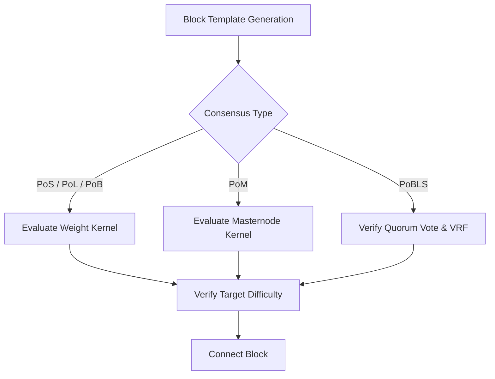

# Implementation Plan: MPA (Multi-Proof Algorithm) Consensus with PoMBL & LLMQ-PoBLS

This implementation plan details the architecture and integration steps to introduce a **Multi-Proof-Algorithm (MPA)** mining system to the KRISTA codebase, building on top of the newly activated ADAM cooperative consensus.

Specifically, we propose the integration of:
1. **Proof of Masternode (PoM)**: Masternode collateral and lifetime-based block production.
2. **Proof of Burn (PoB)**: Unspendable coin burn-based mining weight with time decay.
3. **Proof of Lock (PoL)**: Time-locked output-based mining weight with lock duration multipliers.
4. **Proof of BLS (PoBLS)**: Deterministic, quorum-voted block producer selection.
5. **Long-Living Masternode Quorums (LLMQs)**: Bootstrapped via DKG (Distributed Key Generation) on the active Masternode network.

---

## Proposed Architecture & Mathematical Formulas

The probability of mining the next block under the hybrid MPA system is governed by a unified kernel evaluation equation:

$$\text{KernelHash} < \text{Target} \times \text{Weight}_{\text{Total}}$$

For a given transaction output (UTXO) or Masternode collateral, its mining $\text{Weight}_{\text{Total}}$ is calculated based on its type:

### 1. Proof of Stake (PoS - Baseline)
$$W_{\text{PoS}} = \text{Amount}$$

### 2. Proof of Lock (PoL)
A transaction output containing a timelock (CLTV or CSV) of duration $L$ blocks (up to $L_{\text{MAX}}$):
$$W_{\text{PoL}} = \text{Amount} \times \left(1 + \gamma \cdot \frac{L}{L_{\text{MAX}}}\right)$$
where $\gamma$ is the lock multiplier parameter (e.g., $\gamma = 2.0$ for up to 3x weight bonus).

### 3. Proof of Burn (PoB)
Coins sent to a deterministic burn address (e.g., `kristaBurnAddress...`). Since burned coins are lost forever, they provide a mining weight that decays over time $T$ (elapsed blocks since burn) up to $T_{\text{MAX}}$ blocks:
$$W_{\text{PoB}} = \text{BurnAmount} \times \beta \times \left(1 - \frac{T}{T_{\text{MAX}}}\right)$$
where $\beta$ is a burn-incentive multiplier (e.g., $\beta = 5.0$) and $T < T_{\text{MAX}}$. Once $T \ge T_{\text{MAX}}$, the weight becomes 0.

### 4. Proof of Masternode (PoM)
An active, enabled Masternode with collateral $C$ and active lifetime $t_{\text{active}}$ (blocks since Masternode was enabled/re-enabled):
$$W_{\text{PoM}} = C \times \left(1 + \alpha \cdot \min\left(\frac{t_{\text{active}}}{T_{\text{MAX}}}, 1.0\right)\right)$$
If a Masternode falls out of `ENABLED` status, its lifetime $t_{\text{active}}$ resets to 0.

---

## Proposed Changes by Component

### Component A: Mining Kernel Modifications
#### [MODIFY] [kernel.h](file:///home/bedri/Coin-Projects/KristaTech-KRISTA/src/kernel.h) / [kernel.cpp](file:///home/bedri/Coin-Projects/KristaTech-KRISTA/src/kernel.cpp)
* Implement `CalculateMPAWeight(const COutPoint& prevout, int nTimeTx, int& nWeightType)`:
  * Detect if output is a Masternode collateral (using `masternodeman`). If yes, compute $W_{\text{PoM}}$.
  * Detect if output is locked via CSV/CLTV script. If yes, extract locktime and compute $W_{\text{PoL}}$.
  * Detect if output is a burn output. If yes, calculate decay based on age and compute $W_{\text{PoB}}$.
  * Otherwise, return default $W_{\text{PoS}} = \text{Amount}$.
* Update `CheckStakeKernelHash()` to apply the computed $\text{Weight}_{\text{Total}}$ to the target calculation.

---

### Component B: Proof of Masternode (PoM) & Life Tracking
#### [MODIFY] [masternode.h](file:///home/bedri/Coin-Projects/KristaTech-KRISTA/src/masternode.h) / [masternode.cpp](file:///home/bedri/Coin-Projects/KristaTech-KRISTA/src/masternode.cpp)
* Add a block height tracker for when the Masternode transitioned to `ENABLED` status (`nBlockEnabled`).
* On status changes inside `MasternodeCheck()`, update `nBlockEnabled` or reset it if state is disabled.
* Export `GetMasternodeActiveLifetime(const COutPoint& collateralOutpoint)` helper.

---

### Component C: Proof of BLS & LLMQ Quorums
#### [NEW] [llmq.h](file:///home/bedri/Coin-Projects/KristaTech-KRISTA/src/llmq.h) / [llmq.cpp](file:///home/bedri/Coin-Projects/KristaTech-KRISTA/src/llmq.cpp)
* Implement the Long-Living Masternode Quorum (LLMQ) structure.
* Build a Distributed Key Generation (DKG) session manager:
  * Select $M$ active Masternodes based on the current block's VRF seed.
  * Run a simplified commit-and-reveal protocol to generate a shared quorum public key and individual private key shares.
* Implement PoBLS election rules:
  * In the first 10 seconds of a block interval, each peer generates its per-block key share signature.
  * Masternodes aggregate signatures and publish the winner with the closest hash to the target.

---

### Component D: Consensus Rule Enforcements
#### [MODIFY] [main.cpp](file:///home/bedri/Coin-Projects/KristaTech-KRISTA/src/main.cpp)
* In `CheckBlock()` for blocks at height $\ge \text{nPoMBLHeight}$:
  * Inspect block header version (Version 12).
  * Validate proof types and corresponding weights.
  * Enforce that PoB UTXOs represent valid burn transactions to the designated unspendable burn address.
  * Enforce locktime scripts for PoL blocks.

---

## Verification Plan

### Automated Tests
* **Unit Tests (`test_pivx`)**: Create a unit test suite testing weight calculations, decay behavior of burn UTXOs, and timelock multipliers.
* **Functional Tests (`test/functional/`)**:
  * Implement `consensus_pombl.py` functional test to deploy a local node cluster.
  * Force generate burn transactions and assert the mining weight changes appropriately.
  * Verify time-locked transactions mine blocks and obey lock mechanics.

### Manual Verification
* Deploy the updated nodes on local Podman containers.
* Setup 3 Masternodes on the local network.
* Run DKG session command via RPC (`llmq dkg status`) and verify successful quorum creation.
