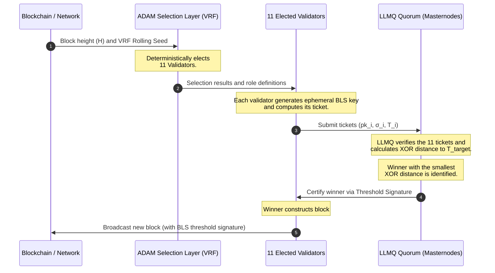

# Proof of BLS (PoBLS) Consensus: Consensus & Incentive Structure

This document details the conceptual design, security analysis, integration, and Model D reward distribution of the **Proof of BLS (PoBLS)** consensus mechanism—an innovative and lightweight consensus model designed for the KristaTech (KRISTA) blockchain.

---

## 1. Introduction and Background

Traditional Proof of Work (PoW) consensus involves high energy consumption and hardware centralization. Meanwhile, standard Proof of Stake (PoS) can lead to a "rich get richer" structure where the wealthiest wallets dominate block production.

**Proof of BLS (PoBLS)** resolves these limitations by introducing a decentralized **cryptographic lottery** model where nodes participate by generating ephemeral cryptographic BLS keys for each block. This model eliminates the requirement for high computing power while ensuring fair block production opportunities for all active participants.

---

## 2. Step-by-Step Mechanism

During each block cycle (e.g., every 30 seconds), the network executes the following steps:

### 2.1. Ticket Generation
1. Each active wallet/node $i$ generates a new ephemeral **BLS keypair** for the target block height ($H$):
   $$\text{BLS Keypair}_i = (sk_i, pk_i)$$
2. The node combines the private key ($sk$), public key ($pk$), and block height ($H$) to generate a hashed ticket:
   $$T_i = \text{Hash}(sk_i \parallel pk_i \parallel H)$$
3. To prove ownership of the private key without revealing it to the network, the node signs the previous block hash ($Hash$) using the ephemeral private key:
   $$\sigma_i = \text{Sign}_{sk_i}(Hash_{prev})$$
4. The node broadcasts a **PoBLS Participation Message** containing its public key ($pk$), signature ($\sigma$), and ticket hash ($T$) to the network.

### 2.2. Ticket Submission Window
* During a very short window at the beginning of the block slot (e.g., the first 5-10 seconds), all nodes submit their participation messages to active **LLMQ Quorum** (Long-Living Masternode Quorum) nodes.
* LLMQ members verify the signatures ($\sigma$ against $pk$) and compile a list of valid tickets.

### 2.3. Winner Selection
1. A **Target Hash** ($T_{target}$) is computed for the current block (derived from the previous block hash or the active VRF rolling seed).
2. The distance between each collected ticket and the target hash is computed using the XOR metric:
   $$D_i = |T_i \oplus T_{target}|$$
3. The node that generated the ticket with the **smallest distance** ($D$) wins the right to produce the block.
4. The LLMQ Quorum validates the winning ticket and confirms the winner with a threshold signature.

### 2.4. Block Production and Verification
* The winning node constructs the block, attaching its ticket details ($pk_i, \sigma_i$) to the coinbase transaction.
* Upon receiving the block, peers verify that the winner's ticket was indeed the closest to the target hash among those validated by the LLMQ, and append the block to the chain.

---

## 3. Security and Threat Analysis

### 3.1. Sybil Attacks and Mitigations
> [!WARNING]
> If submitting tickets were free, an attacker could launch thousands of cheap cloud instances to flood the network with tickets, pushing their probability of winning to near 100%.

**Mitigations:**
* **Masternode-based PoBLS**: Ticket submission is restricted to nodes holding active Masternode collateral (2,100 KRISTA). This attaches a high capital cost to Sybil attempts, making them economically unfeasible.
* **Stake-Weighted Distance**: Any wallet can submit a ticket, but the XOR distance is divided by the wallet's balance:
   $$D_{weighted} = \frac{D_i}{\text{Balance}}$$
   This gives larger balances a proportional advantage (forming a hybrid PoS/PoBLS model).

### 3.2. Nothing-at-Stake and Pre-computation Attacks
> [!CAUTION]
> Because nodes generate their private keys locally, a node could grind millions of BLS key pairs in search of the closest ticket, reverting PoBLS back to a PoW-like hardware race.

**Mitigation:**
* Ephemeral BLS keys must be derived deterministically from the node's long-term identity key ($sk_{node}$) and the previous block hash:
   $$pk_i = \text{DeriveKey}(sk_{node}, Hash_{prev})$$
   This guarantees each node has exactly one valid ticket per block height, making pre-computation grinding impossible.

---

## 4. Performance and Network Overhead

Broadcasting tickets from thousands of nodes every block would cause severe network congestion.
* **LLMQ Aggregation**: The network is divided topologically into LLMQs. Nodes send their tickets to local LLMQ members. The LLMQ filters and forwards only the top closest tickets to the rest of the network, reducing overhead.

---

## 5. Integration with ADAM Consensus (Hybrid ADAM + PoBLS)

Integrating PoBLS with KristaTech's core **ADAM (A Decentralized Approach Model)** cooperative consensus mechanism provides state-of-the-art security and DDoS resistance.

### 5.1. Selection Layer as ADAM (Sybil Resistance)
* ADAM uses a Verifiable Random Function (VRF) rolling seed to deterministically elect a set of **11 Validators** (Miners) per block.
* **PoBLS Integration**: Instead of the entire network submitting tickets, **only the 11 validators elected by ADAM** participate in the PoBLS ticket lottery.
* This eliminates Sybil vulnerability, as the candidate validator pool is already restricted and validated.

### 5.2. Proposer Election as PoBLS (DDoS & Censorship Protection)
* In standard ADAM, the validator sequence is deterministic and known in advance, allowing attackers to target the next leader with DDoS or censorship.
* **PoBLS Integration**: The 11 elected validators generate ephemeral BLS keys to participate in the XOR lottery. The winner is selected dynamically.
* The block proposer remains unpredictable until the block is broadcast, eliminating single points of failure.

### 5.3. Integration Workflow

### 5.4. LLMQ Approval and Block Broadcast
1. **ADAM Election**: ADAM elects 11 validators via VRF.
2. **PoBLS Tickets**: The 11 validators generate ephemeral BLS signatures ($T$) and send them to the active LLMQ.
3. **Distance Check**: LLMQ checks the distance, confirming the winner via threshold signature.
4. **Block Broadcast**: The winner builds the block, appends the threshold signature, and broadcasts it.

---

## 6. Reward Distribution and Incentives under PoBLS

Following the integration of PoBLS, three different economic models could be envisioned for the internal breakdown of the block reward (e.g., the 60% Masternode / 40% Miner-Staker split after block 2,200):

### Model A: Winner-Takes-All (Classic Model)
* **Logic:** The single validator who wins the PoBLS ticket lottery (having the closest XOR distance to the target hash) receives the entire 40% validator allocation and all transaction fees for that block.
* **Distribution Splits:**
  * **Masternode Share (60%):** Paid to the next Masternode in the global queue.
  * **Winning Validator Share (40%):** Paid to the single wallet that won the lottery and produced the block.
* **Evaluation:**
  * **Pros:** Simplest model to implement. Requires no extra coinbase outputs.
  * **Cons:** Since only 1 of the 11 elected validators receives the reward, the resources spent by the other 10 validators in that round are not compensated. This leads to high variance in earnings.

### Model B: Cooperative Reward Sharing (Proposed Model)
* **Logic:** To align fully with ADAM's "cooperative consensus" philosophy, the validator allocation is shared among all elected validators who submit tickets, ensuring active participation is continuously rewarded.
* **Distribution Splits:**
  * **Masternode Share (60%):** Paid to the next Masternode in the global queue.
  * **Winning Validator Share (30%):** Paid to the validator that won the lottery and produced the block (lion's share + transaction fees).
  * **Participant Validator Share (10%):** Shared equally among the other 10 validators who submitted valid tickets but did not win (each receives ~1.00% of the block reward).
* **Evaluation:**
  * **Pros:** Maximizes network security by discouraging offline state for elected validators; they are rewarded as long as they submit valid tickets, even if they don't win. Reduces variance in earnings.
  * **Cons:** Requires creating 12 different outputs in the coinbase transaction (1 MN + 11 validators), slightly increasing transaction size.

### Model C: Quorum (LLMQ) Incentivization
* **Logic:** A small portion is paid to the active LLMQ quorum members who collect, verify, and validate the winner via threshold signature, rewarding them for securing the network.
* **Distribution Splits:**
  * **Masternode Share (50%):** Paid to the next Masternode in the global queue.
  * **LLMQ Quorum Share (10%):** Distributed equally among the active LLMQ members executing the ticket collection and verification for that block.
  * **Winning Validator Share (40%):** Paid to the winning validator.
* **Evaluation:**
  * **Pros:** Directly rewards masternodes for active quorum duties instead of just remaining passive.
  * **Cons:** Since quorum members are already masternodes and participate in the 50%-60% pool, it might create a perception of double rewards.

### Model D: Cooperative Quorum-Validator Hybrid Model (Combination of B and C - Advanced Model)
* **Logic:** This is a combination of Model B (rewarding participating validators) and Model C (rewarding quorum/LLMQ validators). The block producer (winner), candidate participant validators, active LLMQ quorum members, and the general Masternode pool are all rewarded fairly.
* **Distribution Splits (Out of 100% Block Reward):**
  * **Masternode Passive Share (50%):** Paid to the next Masternode in the global deterministic queue (incentivizes holding long-term collateral).
  * **LLMQ Quorum Active Share (10%):** Split equally among the active masternode members validating/signing PoBLS tickets in that block (incentivizes active quorum duties).
  * **Block Producer / Winner Share (15%):** Goes to the single winning PoBLS validator/staker who proposed and signed the block (plus transaction fees).
  * **Validator Participant Share (25%):** Divided equally among the candidate validator nodes in the elected validator set (shared by 10 miners in PoS blocks, and 11 miners in PoW blocks).
* **Evaluation:**
  * **Pros:** Establishes complete alignment and motivation for all network actors (active/passive masternodes, winning/participating validators), maximizing network security.
  * **Cons:** Requires constructing multiple payee outputs in the coinbase and coinstake transactions. Code-level logic must be integrated to identify LLMQ members and ticket submitters for coinbase distribution.

### 6.1. Activation Timing and Network Phases

Model D reward splits and PoBLS validation activate at block height **2,200** on Mainnet and Testnet due to the following network lifecycle phases:

1. **Bootstrap Phase (Blocks 2 - 2,199)**:
   * No masternodes exist or quorums form initially. Reward split is 0% MN / 100% Miner-Staker.
   * Restricting block creation to Model D (which requires quorums and 11 validators) would stall the chain. Initial PoW/PoS is required to bootstrap.
2. **Masternode Accumulation Phase (Blocks 2,000 - 2,199)**:
   * LLMQ quorums (`UPGRADE_POMBL`) activate at block 2,000.
   * This encourages nodes to set up masternodes and lock the 2,100 KRISTA collateral, building a large pool of active nodes.
3. **Maturation & Model D Phase (Blocks 2,200+)**:
   * Once block 2,200 is reached (`UPGRADE_MODELD`), active masternodes exist on the network and the LLMQ quorum infrastructure becomes completely stable.
   * Model D activates to introduce advanced PoBLS consensus and enforce the final sustainable split.
4. **Developer Regression (Regtest)**:
   * To facilitate testing, Model D activates immediately at block height **200** on Regtest.

---

## 7. Position and Rewards of Miners (PoW) and Stakers (PoS)

KristaTech (KRISTA) is a dual network. Reward distribution under Model D adapts to the block type.

> [!IMPORTANT]
> **PoW Never Ends:** Staking blocks do not replace or terminate PoW mining. Even though blocks are categorized as either PoW blocks (proposed by miners) or PoS blocks (proposed by stakers), both types run the full ADAM Proof-of-Work cooperative mining validation loop. Every block height requires Proof-of-Work puzzle solutions and is double-signed under hybrid consensus. Single-signature blocks (temporary or permanent) are strictly prohibited.

### 7.1. Division of PoW and PoS Blocks
Each block in the network is either a **PoW block** (mined by the ADAM validator set) or a **PoS block** (staked by a wallet).

### 7.2. PoW Blocks Reward Distribution
When a block is mined via PoW, the 40% validator portion goes entirely to the **PoW Miners** (ADAM Validator pool):
* **Masternode Share (%60)**: 50% to the queue winner, 10% split among active LLMQ members.
* **PoW Miners Share (%40)**: 15% to the PoBLS Coordinator (Block Producer), and 25% split among the 11 participating miners.

### 7.3. PoS Blocks Reward Distribution
When a block is staked via PoS (a coin holder wins the stake kernel check), the reward is split to incentivize the staker while maintaining the PoW security infrastructure:
* **Masternode Share (%60)**: 50% to the queue winner, 10% split among active LLMQ members.
* **PoS Staker Share (%15)**: Goes to the staker who held coins and won the kernel check (Block Producer).
* **PoW Validator Share (%25)**: Split equally among the 10 elected ADAM miners who solved PoW puzzles and verified the block context (ensuring miners remain active even during PoS blocks).
