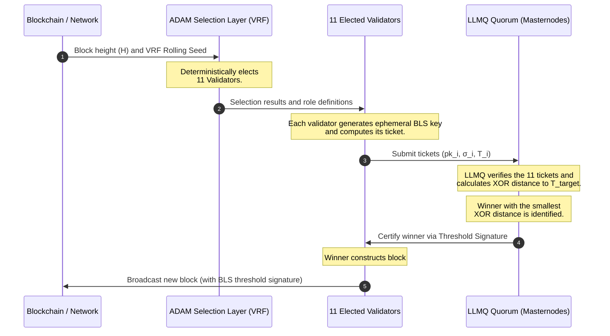

# Proof of BLS (PoBLS) Consensus: Consensus & Incentive Structure

This document details the conceptual design, security analysis, integration, and Model D reward distribution of the **Proof of BLS (PoBLS)** consensus mechanism—an innovative and lightweight consensus model designed for the KristaTech (KRISTA) blockchain.

---

## 1. Introduction and Background

Traditional Proof of Work (PoW) consensus involves high energy consumption and hardware centralization. Meanwhile, standard Proof of Stake (PoS) can lead to a "rich get richer" structure where the wealthiest wallets dominate block production.

**Proof of BLS (PoBLS)** resolves these limitations by introducing a decentralized **cryptographic lottery** model where nodes participate by generating ephemeral cryptographic BLS keys for each block. This model eliminates the requirement for high computing power while ensuring fair block production opportunities for all active participants.

---

## 2. Step-by-Step Mechanism (Conceptual Design)

> [!NOTE]
> **Conceptual vs. Production Execution:** Sections 2–4 present the initial conceptual design and threat analysis of standalone PoBLS. Section 5.4 documents the exact production C++ implementation (`src/adam.cpp`, `src/llmq.cpp`, `src/crypto/bls.cpp`), where deterministic `DeriveBLSFromCKey` keys are authorized by permanent `secp256k1` identities, `ComputePoBLSTicket` hashes `SHA256D(blsPubKey || blsSig || nBlockHeight)` inside committee `ADAMSOL` solutions without exposing secret keys, and unweighted XOR distance (`ComputePoBLSXORDistance`) ranks fallback coordinators when $t \ge 45\text{s}$.

During each block cycle (e.g., every 30 seconds), the conceptual model executes the following steps:

### 2.1. Ticket Generation
1. Each active wallet/node $i$ generates a new ephemeral **BLS keypair** for the target block height ($H$):
   
   $$\text{BLS Keypair}_i = (sk_i, pk_i)$$
   
2. The node combines the private key ($sk$), public key ($pk$), and block height ($H$) to generate a hashed ticket:
   
   $$T_i = \text{Hash}(sk_i \parallel pk_i \parallel H)$$
   
3. To prove ownership of the private key without revealing it to the network, the node signs the previous block hash ($Hash$) using the ephemeral private key:
   
   $$\sigma_i = \text{Sign}_{sk_i}(Hash_{prev})$$
   
4. The node broadcasts a **PoBLS Participation Message** containing its public key ($pk$), signature ($\sigma$), and ticket hash ($T$) to the network.

### 2.2. Ticket Submission Window
* During a very short window at the beginning of the block slot (e.g., the first 5-10 seconds), all nodes submit their participation messages to active **LLMQ Quorum** (Long-Living Masternode Quorum) nodes.
* LLMQ members verify the signatures ($\sigma$ against $pk$) and compile a list of valid tickets.

### 2.3. Winner Selection
1. A **Target Hash** ($T_{target}$) is computed for the current block (derived from the previous block hash or the active VRF rolling seed).
2. The distance between each collected ticket and the target hash is computed using the XOR metric:
   
   $$D_i = |T_i \oplus T_{target}|$$
   
3. The node that generated the ticket with the **smallest distance** ($D$) wins the right to produce the block.
4. The LLMQ Quorum validates the winning ticket and confirms the winner with a threshold signature.

### 2.4. Block Production and Verification
* The winning node constructs the block, attaching its ticket details ($pk_i, \sigma_i$) to the coinbase transaction.
* Upon receiving the block, peers verify that the winner's ticket was indeed the closest to the target hash among those validated by the LLMQ, and append the block to the chain.

---

## 3. Security and Threat Analysis

### 3.1. Sybil Attacks and Mitigations
> [!WARNING]
> If submitting tickets were free, an attacker could launch thousands of cheap cloud instances to flood the network with tickets, pushing their probability of winning to near 100%.

**Mitigations:**
* **Masternode-based PoBLS**: Ticket submission is restricted to nodes holding active Masternode collateral (4,200 KRISTA). This attaches a high capital cost to Sybil attempts, making them economically unfeasible.
* **Stake-Weighted Distance**: Any wallet can submit a ticket, but the XOR distance is divided by the wallet's balance:
   
   $$D_{weighted} = \frac{D_i}{\text{Balance}}$$
   
   This gives larger balances a proportional advantage (forming a hybrid PoS/PoBLS model).

### 3.2. Nothing-at-Stake and Pre-computation Attacks
> [!CAUTION]
> Because nodes generate their private keys locally, a node could grind millions of BLS key pairs in search of the closest ticket, reverting PoBLS back to a PoW-like hardware race.

**Mitigation:**
* Ephemeral BLS keys must be derived deterministically from the node's long-term identity key ($sk_{node}$) and the previous block hash:
   
   $$pk_i = \text{DeriveKey}(sk_{node}, Hash_{prev})$$
   
   This guarantees each node has exactly one valid ticket per block height, making pre-computation grinding impossible.

---

## 4. Performance and Network Overhead

Broadcasting tickets from thousands of nodes every block would cause severe network congestion.
* **LLMQ Aggregation**: The network is divided topologically into LLMQs. Nodes send their tickets to local LLMQ members. The LLMQ filters and forwards only the top closest tickets to the rest of the network, reducing overhead.

---

## 5. Integration with ADAM Consensus (Hybrid ADAM + PoBLS)

Integrating PoBLS with KristaTech's core **ADAM (A Decentralized Approach Model)** cooperative consensus mechanism provides state-of-the-art security and DDoS resistance.

### 5.1. Selection Layer as ADAM (Sybil Resistance)
* ADAM uses a Verifiable Random Function (VRF) rolling seed to deterministically elect a set of **11 Validators** (Miners) per block.
* **PoBLS Integration**: Instead of the entire network submitting tickets, **only the 11 validators elected by ADAM** participate in the PoBLS ticket lottery.
* This eliminates Sybil vulnerability, as the candidate validator pool is already restricted and validated.

### 5.2. Proposer Election as PoBLS (DDoS & Censorship Protection)
* In standard ADAM, the validator sequence is deterministic and known in advance, allowing attackers to target the next leader with DDoS or censorship.
* **PoBLS Integration**: The 11 elected validators generate ephemeral BLS keys to participate in the XOR lottery. The winner is selected dynamically.
* The block proposer remains unpredictable until the block is broadcast, eliminating single points of failure.

### 5.3. Integration Workflow

```mermaid
sequenceDiagram
    autonumber
    participant Network as Blockchain / Network
    participant ADAM as ADAM Selection Layer (VRF)
    participant Validators as 11 Elected Validators
    participant LLMQ as LLMQ Quorum (Masternodes)
    
    Network->>ADAM: Block height (H) and VRF Rolling Seed
    Note over ADAM: Deterministically elects<br/>11 Validators.
    ADAM->>Validators: Selection results and role definitions
    
    Note over Validators: Each validator generates ephemeral BLS key<br/>and computes its ticket.
    Validators->>LLMQ: Submit tickets (pk_i, σ_i, T_i)
    
    Note over LLMQ: LLMQ verifies the 11 tickets and<br/>calculates XOR distance to T_target.
    Note over LLMQ: Winner with the smallest<br/>XOR distance is identified.
    LLMQ->>Validators: Certify winner via Threshold Signature
    
    Note over Validators: Winner constructs block
    Validators->>Network: Broadcast new block (with BLS threshold signature)
```

### 5.4. Production Consensus Implementation (`src/adam.cpp`, `src/llmq.cpp`, `src/crypto/bls.cpp`)
In the production C++ codebase, the PoBLS + ADAM workflow is executed with full cryptographic fidelity:
1. **ADAM Dual-Track + On-Chain Masternode Election (`SelectAdamNodes` & `ElectDualTrackValidators`)**: Using the VRF rolling seed $\text{Seed}_H = \text{SHA256D}(\text{Seed}_{H-1} \parallel \text{blsPubKey}_{H-1} \parallel \text{blsSig}_{H-1})$ (`ComputeNextAdamSeed`), all eligible candidates are deterministically ranked via $\text{SHA256D}(\text{Seed}_H \parallel \text{PubKey}_i)$ to elect 1 Coordinator (via quota-capped quadratic stake-weighted VRF: Active MNs `65`, max 1 `Coin-Lock` `16`, max 3 `Funded PoW-Locks` `4` each [`12` track cap]) and 11 Validators. Once `nHeight >= consensus.nAdamDualTrackHeight` (`UPGRADE_ADAM` = block 200 on Mainnet/Testnet, block 1 on Regtest), the 11 validator seats are allocated via Dual-Track Quotas: **Track 1 (Collateralized Pool — 8 Seats)** split into Sub-Track 1A (**7 seats** for Active Masternodes with unspent 4,200 KRISTA collateral and on-chain heartbeat pings within the last **2,880 blocks**) and Sub-Track 1B (**1 strictly isolated seat** for `250 KRISTA` Coin-Lock miners, spilling to Active MNs if vacant), and **Track 2 (Open PoW Pool — 3 Seats)** for Open PoW miners (`10 KRISTA` funded `PoW-Lock`, `0 KRISTA` `Zero-Coin PoW`, and bootstrap keys; unselected `Coin-Lock` excluded from `Tier 2A`), with ordered empty-seat spillover (**Active Masternode $\to$ Open PoW $\to$ Coin-Lock last resort**).
2. **Deterministic & Pinned BLS12-381 Keys & PoBLS Tickets (`DeriveBLSFromCKey` / `PinBLSPubKey` & `ComputePoBLSTicket`)**: Elected validators and the Coordinator derive deterministic BLS12-381 keys $sk_i = \text{BLST}\underline{\hspace{0.4em}}\text{KeyGen}(sk_{\text{node}})$ directly from their 32-byte ECDSA secret keys, authorized by their permanent `secp256k1` identity keys (`SignBLSWithECDSAFallback`) and persistently pinned in LevelDB (`PinBLSPubKey`), and compute their PoBLS lottery tickets $T_i = \text{SHA256D}(pk_i \parallel \sigma_i \parallel H)$.
3. **XOR Metric Distance Ranking (`ComputePoBLSXORDistance` & `RankValidatorsByPoBLSDistance`)**: Against the block target $T_{\text{target}} = \text{SHA256D}(\text{Seed}_H \parallel H)$, each validator's XOR distance $D_i = |T_i \oplus T_{\text{target}}|$ is computed on $(\lbrace 0, 1 \rbrace^{256}, \oplus)$, ranking active ticket-holding validators in ascending order of $D_i$.
4. **Dynamic Active-MN-Scaled BFT LLMQ & BLS12-381 Aggregation (`llmq::GetTargetQuorumSize`, `ElectQuorumMembers`, `CQuorumSignature::Verify`, `CQuorumSignature::AggregateBLSSignatures`)**: Under `UPGRADE_HARDENING_V1`, the Masternode quorum dynamically scales its committee size $N \in \lbrace 5, 9, 11, 15 \rbrace$ and strict majority BFT threshold $T = \lfloor N / 2 \rfloor + 1 \in \lbrace 3, 5, 6, 8 \rbrace$ from the verified on-chain Active Masternode count (`< 25` MNs $\to$ **3-of-5**, `25–49` MNs $\to$ **5-of-9**, `50–99` MNs $\to$ **6-of-11**, `>= 100` MNs $\to$ **8-of-15**). Members are deterministically elected via $\text{SHA256D}(\text{Seed} \parallel \text{collateralOutpoint})$ and certify the proposed block (`PROPOSEBLOCK` / `QUORUMSIGSHARE`) with deterministic BLS12-381 signatures stored in `block.vQuorumSig` and verified via aggregate pairing (`aggSig.Verify(aggPubKey, blockHash)`).

### 5.5. Starting Difficulty and Bootstrap Spacing
* To ensure stable block times (~30 seconds) and unified chain state propagation from genesis, `consensus.powLimit` is set to `~UINT256_ZERO >> 20` on Mainnet and Testnet. This is exactly `1/2^20` (equivalent to genesis `nBits = 0x1e0ffff0`).
* Hardening the starting target prevents the first 199 blocks from being mined instantly, ensuring P2P connections are established, and preventing split forks during genesis bootstrapping.

---

## 6. Reward Distribution and Incentives under PoBLS

Following the integration of PoBLS, three different economic models could be envisioned for the internal breakdown of the block reward (e.g., the reward split after Model D activation at block 2,200 on Mainnet, 500 on Testnet, 200 on Regtest):

### Model A: Winner-Takes-All (Classic Model)
* **Logic:** The single validator who wins the PoBLS ticket lottery (having the closest XOR distance to the target hash) receives the entire 40% validator allocation and all transaction fees for that block.
* **Distribution Splits:**
  * **Masternode Share (60%):** Paid to the next Masternode in the global queue.
  * **Winning Validator Share (40%):** Paid to the single wallet that won the lottery and produced the block.
* **Evaluation:**
  * **Pros:** Simplest model to implement. Requires no extra coinbase outputs.
  * **Cons:** Since only 1 of the 11 elected validators receives the reward, the resources spent by the other 10 validators in that round are not compensated. This leads to high variance in earnings.

### Model B: Cooperative Reward Sharing (Proposed Model)
* **Logic:** To align fully with ADAM's "cooperative consensus" philosophy, the validator allocation is shared among all elected validators who submit tickets, ensuring active participation is continuously rewarded.
* **Distribution Splits:**
  * **Masternode Share (60%):** Paid to the next Masternode in the global queue.
  * **Winning Validator Share (30%):** Paid to the validator that won the lottery and produced the block (lion's share + transaction fees).
  * **Participant Validator Share (10%):** Shared equally among the other 10 validators who submitted valid tickets but did not win (each receives ~1.00% of the block reward).
* **Evaluation:**
  * **Pros:** Maximizes network security by discouraging offline state for elected validators; they are rewarded as long as they submit valid tickets, even if they don't win. Reduces variance in earnings.
  * **Cons:** Requires creating 12 different outputs in the coinbase transaction (1 MN + 11 validators), slightly increasing transaction size.

### Model C: Quorum (LLMQ) Incentivization
* **Logic:** A small portion is paid to the active LLMQ quorum members who collect, verify, and validate the winner via threshold signature, rewarding them for securing the network.
* **Distribution Splits:**
  * **Masternode Share (50%):** Paid to the next Masternode in the global queue.
  * **LLMQ Quorum Share (10%):** Distributed equally among the active LLMQ members executing the ticket collection and verification for that block.
  * **Winning Validator Share (40%):** Paid to the winning validator.
* **Evaluation:**
  * **Pros:** Directly rewards masternodes for active quorum duties instead of just remaining passive.
  * **Cons:** Since quorum members are already masternodes and participate in the 50%-60% pool, it might create a perception of double rewards.

### Model D: Cooperative Quorum-Validator Hybrid Model (Combination of B and C - Advanced Model)
* **Logic:** This is a combination of Model B (rewarding participating validators) and Model C (rewarding quorum/LLMQ validators). The block producer (winner), candidate participant validators, active LLMQ quorum members, and the general Masternode pool are all rewarded fairly.
* **Distribution Splits (Out of 100% Distributable Block Reward `nBlockVal` after deducting the 7.0% Developer Treasury):**
  * **Masternode Passive Share (35%):** Paid to an Active Masternode deterministically selected via VRF seed modulo (`seed.GetUint64(0) % vActiveMns.size()` in `GetModelDPassiveMasternodePayee`, incentivizing holding long-term collateral).
  * **LLMQ Quorum Active Share (10%):** Split equally (`10% / N` each) among the $N \in \lbrace 5, 9, 11, 15 \rbrace$ active LLMQ Masternode members co-signing the proposed block (`vQuorumSig`, $\lfloor N / 2 \rfloor + 1$ BFT threshold: 3-of-5, 5-of-9, 6-of-11, or 8-of-15 scaled by active Masternode count).
  * **Block Producer / Winner Share (15%):** Goes in full to the VRF-elected Coordinator (or PoBLS XOR-ranked fallback Coordinator at $t \ge 45\text{s}$) in PoW blocks — plus 100% of transaction fees (`nFees`) — or to the winning staker in PoS blocks (where transaction fees are burned).
  * **Validator Participant Share (40% — 20% across 7 MN Seats + 20% across 4 Independent Miner Seats):** Every committee seat that submits a valid PoW puzzle solution (`!vAdamSolutions[i].empty()`, whether primary or legitimate same-track standby at $t \ge 60\text{s}$) receives 100% of its own validator track's per-seat share (20% across 7 Masternode Validator seats at `~2.857%` each + 20% across 4 Independent Miner seats [1 Coin-Lock at `8.00%` + up to 3 Open PoW at `4.00%` each, assigned strictly to non-MN, non-Coin-Lock Open PoW miners]; overflow seats filling empty MN slots earn `nMNSeatBase` `~2.857%`). Unsolved/empty seats receive **0%**, and their unclaimed shares (`nUnclaimedPartSplit`) are split **50% to the Automatic Protocol Burn (`nExpectedBurn = nUnclaimedPartSplit / 2`)** and **50% to the Developer Treasury (`nExpectedTreasury = nTreasurySplit + (nUnclaimedPartSplit - nExpectedBurn)`)**.
* **Evaluation:**
  * **Pros:** Establishes complete alignment and motivation for all network actors (active/passive masternodes, winning/participating validators), maximizing network security.
  * **Cons:** Requires constructing multiple payee outputs in the coinbase and coinstake transactions. Code-level logic must be integrated to identify LLMQ members and ticket submitters for coinbase distribution.

### 6.1. Activation Timing and Network Phases

Model D reward splits and PoBLS validation activate at different heights depending on the network:
* **Mainnet**: Activates at block height **2,200** (`UPGRADE_MODELD` height).
* **Testnet**: Activates at block height **500** (`UPGRADE_MODELD` height).
* **Regtest**: Activates at block height **200** (`UPGRADE_MODELD` height).

The lifecycle phases are structured as follows:

1. **Bootstrap Phase**:
   * **Mainnet**: Blocks 2 - 2,199 (reward split is 0% MN / 100% Miner-Staker).
   * **Testnet**: Blocks 2 - 499 (reward split is 0% MN / 100% Miner-Staker before block 500).
   * **Regtest**: Blocks 2 - 199 (reward split is 0% MN / 100% Miner-Staker before block 200).
   * Restricting block creation to Model D (which requires quorums and 11 validators) would stall the chain since no masternodes exist or quorums form initially.
2. **Masternode Accumulation Phase**:
   * **Mainnet**: Blocks 2,000 - 2,199 (LLMQ quorums/`UPGRADE_POMBL` activate at block 2,000).
   * **Testnet**: Blocks 400 - 499 (LLMQ quorums/`UPGRADE_POMBL` activate at block 400).
   * **Regtest**: Blocks 200 - 299 operate in Version 11 with Model D reward splits (`UPGRADE_MODELD = 200`), followed by Version 12 with 3-of-5 `vQuorumSig` enforcement from Block 300 onward (`UPGRADE_POMBL = 300`).
   * This encourages nodes to set up masternodes and lock the 4,200 KRISTA collateral, building a large pool of active nodes before Model D reward splits are enforced.
3. **Maturation & Model D Phase**:
   * Enforced starting from block 2,200 on Mainnet, block 500 on Testnet, and block 200 on Regtest.
   * Model D activates to introduce advanced PoBLS consensus and enforce the final sustainable split (35% passive MN, 10% active LLMQ, 40% participants [20% across 7 MN seats + 20% across 4 independent miner seats], 15% block winner).

---

## 7. Position and Rewards of Miners (PoW) and Stakers (PoS)

KristaTech (KRISTA) is a dual network. Reward distribution under Model D adapts to the block type.

> [!IMPORTANT]
> **PoW Never Ends:** Staking blocks do not replace or terminate PoW mining. Even though blocks are categorized as either PoW blocks (proposed by miners) or PoS blocks (proposed by stakers), both types run the full ADAM Proof-of-Work cooperative mining validation loop. Every block height requires Proof-of-Work puzzle solutions and is double-signed under hybrid consensus. Single-signature blocks (temporary or permanent) are strictly prohibited.

### 7.1. Division of PoW and PoS Blocks
Each block in the network is either a **PoW block** (mined by the ADAM validator set) or a **PoS block** (staked by a wallet).

### 7.2. PoW Blocks Reward Distribution
When a block is mined via PoW, the 55% active execution portion goes to the **PoW Miners & Coordinator** (ADAM Validator pool) under the **Equal Work, Equal Reward** rule:
* **Masternode Infrastructure Share (45%)**: 35% to the passive queue winner, 10% split among active LLMQ members.
* **PoW Execution Share (55%)**: 15% in full to the PoBLS Coordinator (Block Producer), and 40% distributed across the solved committee seats (`20%` across the 7 Masternode Validator seats at `~2.857%` each + `20%` across the 4 Independent Miner seats [`8.00%` for 1 Coin-Lock + `4.00%` each for 3 Open PoW] for every seat where `!vAdamSolutions[i].empty()`, primary or legitimate same-track standby at $t \ge 60\text{s}$), with unclaimed empty-seat shares split **50% to the Automatic Protocol Burn** and **50% to the Developer Treasury**.

### 7.3. PoS Blocks Reward Distribution
When a block is staked via PoS (a coin holder wins the stake kernel check), the reward is split to incentivize the staker while maintaining the PoW security infrastructure:
* **Masternode Infrastructure Share (45%)**: 35% to the passive queue winner, 10% split among active LLMQ members.
* **PoS Staker Share (15%)**: Goes in full to the staker who held coins and won the kernel check (Block Producer).
* **PoW Validator Share (40%)**: Distributed across the solved ADAM committee seats (`20%` across the 7 Masternode Validator seats + `20%` across the 4 Independent Miner seats) that solved PoW puzzles and verified the block context (ensuring miners remain active even during PoS blocks).
