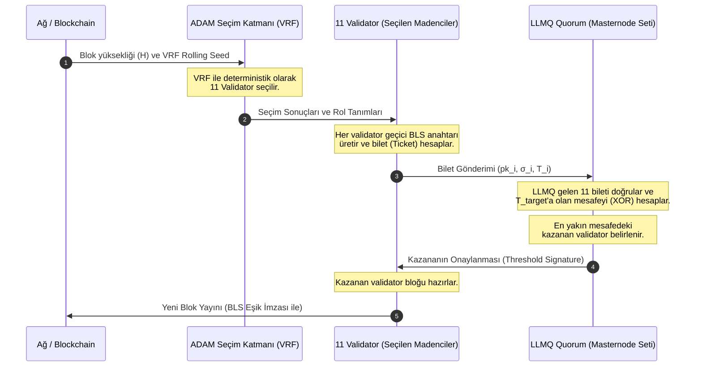

# Proof of BLS (PoBLS) Consensus: Konsensüs ve Teşvik Yapısı

Bu doküman, KristaTech (KRISTA) ağında uygulanan yenilikçi ve hafif bir konsensüs modeli olan **Proof of BLS (PoBLS)** mekanizmasının kavramsal tasarımını, entegrasyonunu ve Model D ödül yapısını içermektedir.

---

## 1. Giriş ve Arka Plan

Geleneksel Proof of Work (PoW) yüksek enerji tüketimine yol açarken; standart Proof of Stake (PoS) ise zenginlerin daha çok kazandığı ("rich get richer") ve ağ kontrolünü kolayca ele geçirebildiği bir yapıya evrilebilir. 

**Proof of BLS (PoBLS)**, her blokta düğümlerin (peers) geçici (ephemeral) kriptografik anahtarlar üreterek katıldığı, merkeziyetsiz bir **kriptografik çekiliş (cryptographic lottery)** modelidir. Bu model, madencilik için yüksek işlem gücü gereksinimini ortadan kaldırırken, ağdaki tüm aktif katılımcılara adil bir blok üretme şansı sunar.

---

## 2. Adım Adım Çalışma Mekanizması

Ağdaki her blok döngüsünde (örneğin her 30 saniyede bir) şu adımlar izlenir:

### 2.1. Bilet Üretimi (Ticket Generation)
1. Her aktif cüzdan/düğüm $i$, o blok yüksekliği ($H$) için özel yeni bir geçici **BLS anahtar çifti** üretir:
   $$\text{BLS Keypair}_i = (sk_i, pk_i)$$
2. Düğüm, gizli anahtar (private key) ve açık anahtarın (public key) kombinasyonunu blok yüksekliği ile birleştirerek bir hash (bilet) oluşturur:
   $$T_i = \text{Hash}(sk_i \parallel pk_i \parallel H)$$
3. Düğüm, gizli anahtarını ağa ifşa etmeden sahipliğini kanıtlamak için, bir önceki bloğun hash değerini ($Hash_{prev}$) bu yeni geçici anahtarla imzalar:
   $$\sigma_i = \text{Sign}_{sk_i}(Hash_{prev})$$
4. Düğüm, ağa açık anahtarını ($pk_i$), imzasını ($\sigma_i$) ve bilet hash'ini ($T_i$) içeren bir **PoBLS Katılım Mesajı** yayınlar.

### 2.2. Bilet Toplama ve Zaman Penceresi (Submission Window)
* Blok süresinin çok küçük bir diliminde (örneğin ilk 5-10 saniye içinde) tüm düğümler katılım mesajlarını ağa veya aktif **LLMQ Quorum** (Long-Living Masternode Quorum) düğümlerine gönderir.
* LLMQ üyeleri gelen tüm biletleri doğrular ($\sigma_i$ imzasının $pk_i$ ile uyuşup uyuşmadığını kontrol eder) ve listeler.

### 2.3. Kazananın Belirlenmesi (Winner Selection)
1. O blok için ağ tarafından belirlenen bir **Hedef Hash** ($T_{target}$) hesaplanır (Örn: Bir önceki bloğun hash değeri veya aktif VRF tohumu).
2. Toplanan geçerli biletlerin hedef hash'e olan mesafesi (XOR metriği veya mutlak fark) hesaplanır:
   $$D_i = |T_i \oplus T_{target}|$$
3. Hedef hash'e **en yakın** (en küçük $D_i$ mesafesine sahip) bileti üreten düğüm, o blok için **blok üretme hakkını (block production right)** kazanır.
4. LLMQ Quorum'u, en yakın mesafedeki kazananı doğrular ve ortak bir eşik imzası (threshold signature) ile onaylayarak ağa duyurur.

### 2.4. Blok Üretimi ve Doğrulama
* Kazanan düğüm, bloğu hazırlar. Coinbase işleminde kendi bilet detaylarını ($pk_i, \sigma_i$) sunar.
* Diğer düğümler bloğu aldıklarında, kazananın biletinin gerçekten de LLMQ tarafından toplanan ve hedefe en yakın bilet olduğunu doğrular ve bloğu zincire ekler.

---

## 3. Güvenlik ve Tehdit Analizi

### 3.1. Sybil Saldırıları (Sybil Attacks) ve Önleme Yolları
> [!WARNING]
> Bilet üretmek tamamen ücretsiz olursa, bir saldırgan AWS/GCP üzerinde 100.000 ucuz sanal sunucu açarak 100.000 bilet üretebilir ve her bloğu kazanma şansını %99'a çıkarabilir.

**Çözüm Önerileri:**
* **Masternode Tabanlı PoBLS:** Bilet gönderme hakkı sadece teminatı (2.100 KRISTA) olan aktif masternode'lara verilir. Bu durumda Sybil saldırısı yapmak, devasa miktarda KRISTA satın alıp kilitlemeyi gerektireceğinden ekonomik olarak imkansızlaşır.
* **Stake Ağırlıklı Mesafe (Stake-Weighted Distance):** Herhangi bir cüzdan bilet gönderebilir, ancak hesaplanan mesafe ($D_i$) cüzdandaki coin miktarı ile bölünür:
  $$D_{weighted} = \frac{D_i}{\text{Balance}}$$
  Bu sayede daha çok bakiyesi olan cüzdanların biletleri hedefe daha yakın hale gelir (hibrid PoS/PoBLS yapısı).

### 3.2. Nothing-at-Stake ve Ön-Hesaplama (Pre-computation) Saldırısı
> [!CAUTION]
> Bir düğüm, gizli anahtarı kendisi ürettiği için yerel olarak saniyede milyonlarca BLS anahtar çifti üretip, hedef hash'e en yakın olanı seçip sadece onu gönderebilir. Bu durum PoBLS'i bir anda işlemci gücüne dayalı klasik bir PoW yarışına dönüştürür.

**Çözüm Önerisi:**
* Bilet üretiminde kullanılan BLS anahtar çiftinin deterministik olarak düğümün sabit kimliğine (node ID/Masternode UTXO) ve bir önceki bloğun verilerine bağlı olması gerekir. Örneğin:
  $$pk_i = \text{DeriveKey}(sk_{node}, Hash_{prev})$$
  Düğümler rastgele anahtar üretemez; her düğümün o blok için üretebileceği sadece tek bir geçerli bilet olabilir. Bu, pre-computation yarışını tamamen engeller.

---

## 4. Performans ve Ağ Yükü

* Her blokta binlerce düğümün tüm ağa bilet yayınlaması ciddi bir ağ trafiğine (network congestion) neden olur.
* **LLMQ Çözümü:** Ağ, coğrafi veya topolojik olarak LLMQ Quorum'larına bölünür. Her düğüm biletini kendi bölgesindeki en yakın LLMQ masternode'una gönderir. LLMQ kendi içinde sadece en yakın ilk 5 bileti üst quoruma veya ana ağa iletir. Bu sayede ağ trafiği minimumda tutulur.

---

## 5. ADAM Konsensüsü ile Entegrasyon (ADAM + PoBLS Hibrit Yapısı)

PoBLS bilet sisteminin tek başına kullanılması yerine, KristaTech'in çekirdek teknolojisi olan **ADAM (A Decentralized Approach Model)** kooperatif konsensüsü ile entegre edilmesi, güvenlik ve verimliliği en üst seviyeye taşır. Entegrasyon şu şekilde kurgulanabilir:

### 5.1. Seçim Katmanı Olarak ADAM (Sybil Direnci)
* ADAM konsensüsü, VRF (Verifiable Random Function) protokolü aracılığıyla her blok döngüsü için aktif ve geçerli Masternode'lar arasından deterministik olarak **11 adet madenci düğümü (Validator Set)** seçer.
* **PoBLS Entegrasyonu:** Tüm ağın veya binlerce masternode'un bilet göndermesi yerine, **sadece o blok için ADAM tarafından seçilen 11 adet validator** PoBLS bilet çekilişine katılabilir.
* Bu entegrasyon, Sybil saldırısı (sahte sunucular açarak bilet doldurma) riskini tamamen sıfırlar; çünkü bilet gönderebilecek düğüm kümesi önceden ADAM konsensüsü ile sınırlandırılmış ve doğrulanmıştır.

### 5.2. Blok Üretici Belirleme Katmanı Olarak PoBLS (DDoS ve Sansür Koruması)
* Klasik ADAM konsensüsünde, 11 madencinin sırası belirli olduğundan, kötü niyetli bir aktör sıradaki blok üreticisini önceden tahmin edip ona DDoS saldırısı düzenleyerek ağı yavaşlatabilir veya işlemleri sansürleyebilir.
* **PoBLS Entegrasyonu:** Seçilen 11 ADAM madencisi kendi aralarında geçici BLS anahtarları ile bilet oluşturur ve Quorum'a (LLMQ) gönderir. Quorum içinde yapılan en yakın mesafe çekilişi ile blok üreticisi anlık olarak belirlenir.
* Blok üreticisi bilet hash'i hedefe en yakın olana kadar dışarıdan tahmin edilemez. Bu durum, ağdaki **tek hata noktalarını (single point of failure)** ortadan kaldırır ve sansür direncini maksimize eder.

### 5.3. Entegrasyon İş Akışı (Workflow)

### 5.4. LLMQ Onayı ve Blok Yayını
1. **ADAM Seçimi:** ADAM, VRF ile 11 validator seçer.
2. **PoBLS Biletleri:** Bu 11 validator hızlıca geçici BLS imza commitments ($T_i$) üretip aktif LLMQ'ya gönderir.
3. **Mesafe Karşılaştırması:** LLMQ, gelen 11 biletin hedefe olan mesafesini hesaplar ve kazananı eşik imzası ile onaylar.
4. **Blok Yayını:** Kazanan validator bloğu üretir, LLMQ eşik imzasını blok başlığına ekler ve ağa yayınlar.

---

## 6. Ödül Dağılımı ve Teşvik Yapısı (Reward Distribution under PoBLS)

PoBLS entegrasyonu sonrasında blok ödülünün (örneğin Blok 2.200+ için %60 Masternode / %40 Miner-Staker dağılımının) kendi içindeki kırılımı için üç farklı ekonomik model kurgulanabilir:

### Model A: Kazanan Hepsini Alır (Winner-Takes-All - Klasik Model)
* **Mantık:** PoBLS bilet çekilişini kazanan (hedefe en yakın XOR mesafesine sahip) tek bir validator, o blok için ayrılan %40'lık validator payının ve işlem ücretlerinin tamamını alır.
* **Dağılım Oranları:**
  * **Masternode Payı (%60):** Klasik sıradaki Masternode'a gider.
  * **Kazanan Validator Payı (%40):** Çekilişi kazanan ve bloğu üreten tek cüzdana gider.
* **Değerlendirme:**
  * **Artıları:** Uygulaması en basit olan modeldir. Ekstra coinbase çıktısı gerektirmez.
  * **Eksileri:** Seçilen 11 validatorün sadece 1 tanesi ödül kazandığı için diğer 10 validatorün o turda harcadığı kaynak ödüllendirilmez. Gelir dalgalanması (variance) yüksektir.

### Model B: Kooperatif Ödül Paylaşımı (Cooperative Reward Sharing - Önerilen Model)
* **Mantık:** ADAM'ın "kooperatif konsensüs" felsefesine tam uyum sağlamak amacıyla, validator payı seçilen ve bilet gönderen validatorler arasında paylaştırılır. Bu sayede aktif katılım sürekli ödüllendirilir.
* **Dağılım Oranları:**
  * **Masternode Payı (%60):** Sıradaki Masternode'a gider.
  * **Kazanan Validator Payı (%30):** Bloğu üreten ve çekilişi kazanan validatore gider (Aslan payı + İşlem ücretleri).
  * **Katılımcı Validator Payı (%10):** Çekilişi kazanamayan ancak geçerli bilet gönderen diğer 10 validatore eşit olarak bölünür (Her biri blok ödülünün %1.00'ini alır).
* **Değerlendirme:**
  * **Artıları:** Ağ güvenliğini maksimumda tutar. Seçilen validatorlerin çevrimdışı olmasını önler; çünkü bilet gönderdikleri sürece kazanamasalar dahi ödül alırlar. Gelir dalgalanmasını düşürür.
  * **Eksileri:** Coinbase işleminde 12 farklı çıktı (1 MN + 11 validator) oluşturulması gerekir. Çok az miktar işlem boyutu (tx size) artışına sebep olur.

### Model C: Quorum (LLMQ) Teşviki
* **Mantık:** Biletleri toplayan, doğrulayan ve kazananı eşik imzası (threshold signature) ile onaylayan aktif LLMQ quorum üyelerine de ağın güvenliğini sağladıkları için ufak bir pay verilir.
* **Dağılım Oranları:**
  * **Masternode Payı (%50):** Sıradaki Masternode'a gider.
  * **LLMQ Quorum Payı (%10):** O bloktaki bilet toplama ve doğrulama işlemini yürüten aktif LLMQ üyelerine eşit dağıtılır.
  * **Kazanan Validator Payı (%40):** Çekilişi kazanan validatore gider.
* **Değerlendirme:**
  * **Artıları:** Masternode'ların sadece pasif kalmasını değil, quorum görevlerini de dürüstçe yerine getirmesini doğrudan ödüllendirir.
  * **Eksileri:** Quorum üyeleri zaten masternode olduklarından ve %50-%60 havuzundan yararlandıklarından çifte teşvik (double reward) algısı yaratabilir.

### Model D: Kooperatif Quorum-Validator Hibrit Modeli (Model B ve C'nin Birleşimi - En Gelişmiş Model)
* **Mantık:** Model B (Katılımcı validatorlerin ödüllendirilmesi) ile Model C (Quorum/LLMQ doğrulayıcılarının ödüllendirilmesi) modellerinin birleşimidir. Hem blok üreticisi (winner), hem katılımcı aday validatorler, hem aktif LLMQ quorum üyeleri, hem de genel Masternode havuzu adil bir şekilde ödüllendirilir.
* **Dağılım Oranları (%100 Blok Ödülü Üzerinden):**
  * **Masternode Pasif Payı (%50):** Sıradaki Masternode'a (global deterministic queue) gider. Pasif masternode sahipliğini teşvik eder.
  * **LLMQ Quorum Aktif Payı (%10):** O bloktaki bilet toplama ve doğrulama işlemini yürüten aktif LLMQ masternode üyelerine eşit dağıtılır (Aktif masternode görevi teşviki).
  * **Kazanan Validator (Block Producer) Payı (%15):** Çekilişi (XOR mesafesini) kazanan ve bloğu hazırlayıp imzalayan validatore gider (Artı transaction fees).
  * **Katılımcı Validator Payı (%25):** Çekilişi kazanamayan ancak geçerli bilet gönderen diğer aday validatorlere eşit olarak bölünür (PoS bloklarında 10 validator arasına, PoW bloklarında 11 validator arasına eşit bölüştürülür).
* **Değerlendirme:**
  * **Artıları:** Ağdaki tüm aktörleri (aktif/pasif masternodeler, kazanan/katılan validatorler) tam uyum içinde ve en yüksek motivasyonla çalıştırır. Güvenliği en üst düzeye verir.
  * **Eksileri:** Coinbase ve coinstake çıktılarında çoklu ödemeler (payee list) oluşturulması gerekir. Kod seviyesinde LLMQ üyelerini ve bilet gönderenleri tespit eden coinbase dağıtım mantığının entegre edilmesi gerekir.

### 6.1. Model D Aktivasyon Zamanlaması ve Ağ Fazları (Activation Timing & Network Phases)

Model D ödül dağılımı ve PoBLS konsensüsü ana ağda (Mainnet) **blok 2.200** itibarıyla aktifleşir. Bu zamanlamanın ardında hem teknik hem de ekonomik gerekçeler bulunmaktadır:

1. **Ağ Başlangıç Aşaması (Bootstrap Phase - Blok 2 - 2.199)**:
   * Ağın yeni başladığı bu dönemde henüz kurulmuş veya aktifleşmiş bir Masternode ya da quorum yoktur. Ağın güvenliğini ve blok üretim kararlılığını sağlamak için ödüllerin %100'ü geleneksel madencilere ve ilk stakerlara gider. 
   * Eğer Model D başlangıçta aktif olsaydı, oy verecek ve bilet toplayacak yeterli Masternode ve LLMQ Quorum'u bulunamayacağı için ağ blok 2'de kilitlenir ve ilerleyemezdi.
2. **Masternode Birikim Aşaması (MN Accumulation Phase - Blok 2.000 - 2.199)**:
   * LLMQ quorums (`UPGRADE_POMBL`) blok 2000'de aktifleşir.
    * Masternode kurulumunu teşvik etmek için teminat miktarı kilitlenir. Yatırımcılar 2.100 KRISTA teminat kilitleyerek masternode'larını kurarlar.
   * Bu süreç boyunca ağda LLMQ Quorum'larını (Long-Living Masternode Quorum) sağlıklı, kararlı ve merkeziyetsiz bir şekilde yürütebilecek **büyük bir Masternode havuzu birikir**.
3. **Olgunlaşma Dönemi (Maturation & Model D Phase - Blok 2.200+)**:
   * Blok 2.200'e gelindiğinde (`UPGRADE_MODELD`), ağda aktif masternode'lar bulunur ve LLMQ quorum altyapısı tamamen kararlı hale gelir. 
   * Bu noktadan sonra ağın güvenliğini ve sansür direncini en üst seviyeye çıkarmak için **Model D** ve **PoBLS** kooperatif konsensüs kuralları devreye alınır.
4. **Geliştirici Kolaylığı (Regtest)**:
   * Geliştirme kolaylığı ve yerel entegrasyon testlerinin koşabilmesi için bu bekleme sınırı **Regtest (yerel test ağı) ortamında bypass edilmiştir**. Regtest üzerinde Model D, ADAM konsensüsü başlar başlamaz (blok 200'de) doğrudan aktif hale gelir.

---

## 7. Madencilerin (PoW) ve Staker'ların (PoS) Konumu ve Ödüllendirilmesi

KristaTech (KRISTA) hibrit (dual) bir ağ yapısına sahiptir. PoBLS ve ADAM entegrasyonu sonrasında PoW ve PoS ödül dağılımı şu kurallara göre işler:

### 7.1. PoW ve PoS Bloklarının Ayrımı
Ağda her blok **ya bir PoW bloğudur** (ADAM validatorleri tarafından kazılır) **ya da bir PoS bloğudur** (cüzdanında KRISTA bulunduran stakerlar tarafından stake edilir).

### 7.2. PoW Bloklarında Ödül Dağılımı (Model D ile)
Bir blok PoW olarak üretildiğinde, %40'lık "Validator" payı tamamen **PoW Madencilerine** (ADAM Validator kümesine) gider:
* **Masternode Payları (%60):** %50 sıradaki Masternode'a, %10 aktif LLMQ üyelerine dağıtılır.
* **PoW Madencileri Payı (%40):** 11 ADAM madencisinden çekilişi (PoBLS) kazanan **Blok Üreticisi (Koordinatör)** %15 alır. Diğer 10 katılımcı madenci %25'i aralarında paylaşır.

### 7.3. PoS Bloklarında Ödül Dağılımı (Model D ile)
Bir blok PoS olarak üretildiğinde (Staking yapan cüzdan kernel check kazandığında), ödül dağılımı hem stakerı hem de bloğu doğrulayan PoW altyapısını koruyacak şekilde bölüştürülür:
* **Masternode Payları (%60):** %50 sıradaki Masternode'a, %10 aktif LLMQ üyelerine dağıtılır.
* **PoS Staker Payı (%15):** Blok üretimini başlatan ve coin kilitleyerek kernel check kazanan **PoS Staker** cüzdanına gider.
* **PoW Doğrulayıcı Payı (%25):** O blokta PoW puzzle'larını çözen ve PoBLS biletlerini sunarak bloğun fiziksel doğruluğunu/güvenliğini sağlayan 10 ADAM madencisine (staker hariç) eşit dağıtılır (Böylece PoS döneminde bile PoW madencileri sürekli teşvik edilerek ağın hashing gücü korunmuş olur).

