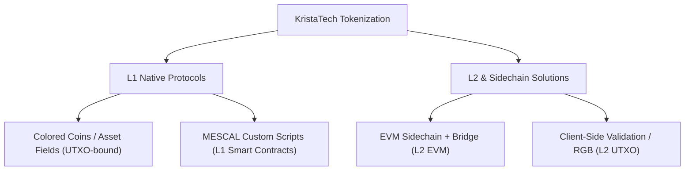

# Study: Asset Tokenization Framework for KristaTech (KRISTA)

This study explores architectural options for introducing tokenized assets (user-defined tokens, NFTs, and stablecoins) on the KristaTech (KRISTA) blockchain. Since KRISTA is a PIVX-derived UTXO blockchain utilizing the ADAM consensus, we analyze both Layer 1 (L1) native integrations and Layer 2 (L2) / Sidechain solutions.

---

## 1. Architectural Options Overview

We categorize tokenization strategies into three main paradigms:



---

## 2. Option A: L1 Native Tokenization (UTXO-Bound)

In this approach, assets are managed directly on the KRISTA UTXO ledger.

### A.1. Asset Fields / Colored Coins Protocol
* **Concept**: Modify the transaction outputs (`CTxOut`) to include optional metadata fields: `asset_id`, `amount`, and `metadata_hash`. 
* **Mechanism**:
  - **Asset Creation (OP_ASSET_CREATE)**: A special transaction that registers a new asset ID, supply, decimals, and metadata URL.
  - **Asset Transfer (OP_ASSET_SEND)**: Standard UTXO inputs are spent to create outputs that carry the asset payload. Nodes validate that the sum of asset inputs equals the sum of asset outputs for that `asset_id`.
* **Pros**:
  - Extremely secure; assets leverage the full security of ADAM consensus directly.
  - High performance; asset transfers are processed in standard UTXO transaction verification pipelines.
* **Cons**:
  - Limited programmability (no complex dynamic state logic like Uniswap/AMMs).
  - Requires hard-fork / consensus-level changes to `CTxIn`/`CTxOut` serialization and validation rules.

### A.2. MESCAL Script-Based Token Templates
* **Concept**: Leverage the MESCAL (Decenomy/KristaTech Smart Contract) framework to implement tokenized assets.
* **Mechanism**:
  - Extend the existing tree-based action scripts in MESCAL to define a "Token Minting and Transfer" template.
  - Standard transfer rules (e.g. multi-sig, time-locked releases) are enforced by script validators, allowing tokenized real-world assets (RWA) with built-in compliance or locks.
* **Pros**:
  - Fits directly into the existing MESCAL architecture.
  - Supports multi-signature escrow, mediator dispute resolution, and time-locked distribution natively.
* **Cons**:
  - Scripts are validated individually per UTXO; global state tracking (e.g., total token circulation, blacklists) is hard to implement natively on-chain without bloating UTXOs.

---

## 3. Option B: Layer 2 & Sidechain Solutions

In this approach, complex smart contracts and token logic run on a separate layer, anchoring to KRISTA L1 for finality.

### B.1. EVM-Compatible Sidechain with Masternode Bridge (Recommended L2)
* **Concept**: Spin up an EVM-compatible sidechain (using an engine like Geth, Polygon Edge, or Avalanche Subnet) where block producers are elected from the KRISTA L1 Masternode pool.
* **Bridge Mechanism**:
  ```
  [ KRISTA L1 Wallet ]  <--- (Lock / Mint) --->  [ EVM L2 Smart Contract ]
           |                                                |
     Lock KRISTA on L1                               Mint Wrapped KRISTA (wKRISTA)
           |                                                |
    Masternodes sign multisig ---------------------> Verify signatures on L2
  ```
  - **Two-way peg**: Masternodes act as bridge validators. When KRISTA coins are locked in a multisig address on L1, the masternode quorum signs a cross-chain message to mint wrapped coins (`wKRISTA`) or custom assets on L2.
* **Pros**:
  - **Full Programmability**: Access to Solidity, MetaMask, ERC-20, ERC-721 (NFTs), Uniswap, Aave, and the entire Ethereum developer ecosystem.
  - **No L1 Bloat**: The main KRISTA chain remains lightweight and secure; high-frequency asset trading happens on L2.
* **Cons**:
  - Bridge security depends on the honest majority of the Masternode quorum.
  - Higher infrastructure setup (requires block explorers for L2, RPC nodes, and bridge software).

### B.2. Client-Side Validation (RGB / Taproot Assets Model)
* **Concept**: Keep asset data off-chain, using the KRISTA UTXO ledger solely as a double-spend prevention registry (Commitment Layer).
* **Mechanism**:
  - Tokens and contracts are defined off-chain.
  - Transacting parties verify the history of asset ownership client-side.
  - The transaction commits the cryptographic hash of the asset transfer into a standard KRISTA transaction output (e.g., using `OP_RETURN` or Taproot-like script spending).
* **Pros**:
  - **Infinite Scalability**: Only small cryptographic commitments touch the main blockchain.
  - **Privacy**: Asset details and transaction histories are only visible to the sender and receiver.
* **Cons**:
  - Very high wallet integration complexity.
  - Client-side data storage management is complex; if a user loses their off-chain transaction history data, they lose their assets.

---

## 4. Comparison Matrix

| Criteria | L1 Colored Coins | L1 MESCAL Templates | L2 EVM Sidechain | L2 Client-Side (RGB) |
| :--- | :---: | :---: | :---: | :---: |
| **Development Complexity** | Medium | Low (Existing structure) | High | Extremely High |
| **Smart Contract Flexibility**| Low | Medium | **Extremely High** | Medium |
| **L1 Performance Impact** | Medium (UTXO bloat) | Medium (Script size) | **None** (L2 handles load) | **Low** (Hash commitments) |
| **Ecosystem & Tooling** | None (Custom) | None (Custom) | **Rich** (Solidity/MetaMask) | None (Emerging) |
| **Upgrade Requirement** | Hard Fork | Minor Upgrades | **None** (Self-contained) | None |

---

## 5. Recommended Implementation Roadmap

To deliver the maximum impact with manageable development risk, we recommend a two-phase implementation plan:

### Phase 1: Short-Term (L1 MESCAL Asset Scripts)
1. Define a standard **Token Template** within the smartcontractwidget Designer.
2. The template generates UTXOs with script structures that lock coins representing physical/tokenized assets.
3. Use the existing Escrow and Mediator workflows to govern asset ownership transfers, compliance, and recovery paths.

### Phase 2: Medium-Term (L2 EVM Sidechain Integration)
1. Launch an EVM-compatible sidechain anchored to KRISTA.
2. Utilize the **LLMQ Masternode Quorums** (which we set up for ADAM/MPA consensus) to act as the Bridge Multisig Validator Set.
3. Deploy ERC-20 and ERC-721 token templates on the EVM sidechain, enabling users to trade tokenized assets via Metamask using wrapped KRISTA as gas.
