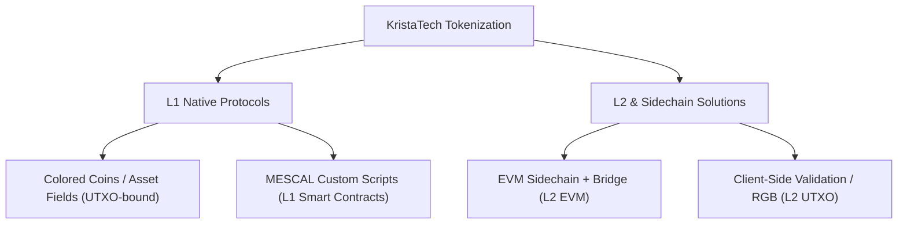

# Çalışma: KristaTech (KRISTA) için Varlık Tokenlaştırma Çerçevesi

Bu çalışma, KristaTech (KRISTA) blokzincirinde tokenlaştırılmış varlıkları (kullanıcı tanımlı tokenlar, NFT'ler ve stabilcoinler) tanıtmak için mimari seçenekleri incelemektedir. KRISTA, ADAM konsensüsünü kullanan, KRISTATECH türevi bir UTXO blokzinciri olduğundan, hem Katman 1 (L1) yerel entegrasyonlarını hem de Katman 2 (L2) / Yan Zincir (Sidechain) çözümlerini analiz ediyoruz.

---

## 1. Mimari Seçeneklere Genel Bakış

Tokenlaştırma stratejilerini üç ana paradigmada sınıflandırıyoruz:



---

## 2. Seçenek A: L1 Yerel Tokenlaştırma (UTXO Bağlantılı)

Bu yaklaşımda, varlıklar doğrudan KRISTA UTXO defterinde yönetilir.

### A.1. Asset Fields / Colored Coins Protokolü
* **Konsept**: İşlem çıktılarını (`CTxOut`) isteğe bağlı metadata alanlarını içerecek şekilde değiştirmek: `asset_id`, `amount` ve `metadata_hash`. 
* **Mekanizma**:
  - **Asset Creation (OP_ASSET_CREATE)**: Yeni bir asset ID'si, arz, basamaklar (decimals) ve metadata URL'sini kaydeden özel bir işlem.
  - **Asset Transfer (OP_ASSET_SEND)**: Standart UTXO girdileri, varlık yükünü (payload) taşıyan çıktılar oluşturmak üzere harcanır. Düğümler (nodes), varlık girdilerinin toplamının, o `asset_id` için varlık çıktılarının toplamına eşit olduğunu doğrular.
* **Artıları**:
  - Son derece güvenli; varlıklar doğrudan ADAM konsensüsünün tam güvenliğinden yararlanır.
  - Yüksek performans; varlık transferleri standart UTXO işlem doğrulama hatlarında (pipelines) işlenir.
* **Eksileri**:
  - Sınırlı programlanabilirlik (Uniswap/AMM'ler gibi karmaşık dinamik durum mantığı yoktur).
  - `CTxIn`/`CTxOut` serileştirme ve doğrulama kurallarında sert çatal (hard-fork) / konsensüs seviyesinde değişiklikler gerektirir.

### A.2. MESCAL Script Tabanlı Token Şablonları
* **Konsept**: Tokenlaştırılmış varlıkları uygulamak için MESCAL (Decenomy/KristaTech Akıllı Sözleşme) çerçevesinden yararlanmak.
* **Mekanizma**:
  - Bir "Token Basımı ve Transferi" (Token Minting and Transfer) şablonu tanımlamak için MESCAL'deki mevcut ağaç tabanlı eylem scriptlerini genişletmek.
  - Standart transfer kuralları (örneğin çoklu imza, zaman kilitli salınımlar), script doğrulayıcıları tarafından zorunlu kılınarak yerleşik uyumluluk veya kilitlere sahip tokenlaştırılmış gerçek dünya varlıklarına (RWA) olanak tanır.
* **Artıları**:
  - Mevcut MESCAL mimarisine doğrudan uyar.
  - Çoklu imzalı emanet (escrow), arabulucu uyuşmazlık çözümü ve zaman kilitli dağıtımı yerel olarak destekler.
* **Eksileri**:
  - Scriptler UTXO başına ayrı ayrı doğrulanır; küresel durum takibi (örneğin, toplam token sirkülasyonu, kara listeler), UTXO'ları şişirmeden zincir üzerinde yerel olarak uygulanması zordur.

---

## 3. Seçenek B: Katman 2 ve Yan Zincir (Sidechain) Çözümleri

Bu yaklaşımda, karmaşık akıllı sözleşmeler ve token mantığı, kesinlik (finality) için KRISTA L1'e çıpalanarak (anchoring) ayrı bir katmanda çalışır.

### B.1. Masternode Köprüsü ile EVM Uyumlu Yan Zincir (Önerilen L2)
* **Konsept**: Blok üreticilerinin KRISTA L1 Masternode havuzundan seçildiği EVM uyumlu bir yan zincir (Geth, Polygon Edge veya Avalanche Subnet gibi bir motor kullanarak) oluşturmak.
* **Köprü Mekanizması**:
  ```
  [ KRISTA L1 Wallet ]  <--- (Lock / Mint) --->  [ EVM L2 Smart Contract ]
           |                                                |
     Lock KRISTA on L1                               Mint Wrapped KRISTA (wKRISTA)
           |                                                |
    Masternodes sign multisig ---------------------> Verify signatures on L2
  ```
  - **İki yönlü sabitleme (Two-way peg)**: Masternode'lar köprü doğrulayıcıları olarak hareket eder. KRISTA coinleri L1 üzerinde çoklu imzalı (multisig) bir adreste kilitlendiğinde, masternode kuorumu L2 üzerinde sarılmış coinleri (`wKRISTA`) veya özel varlıkları basmak (mint) için zincirler arası bir mesajı imzalar.
* **Artıları**:
  - **Tam Programlanabilirlik**: Solidity, MetaMask, ERC-20, ERC-721 (NFT'ler), Uniswap, Aave ve tüm Ethereum geliştirici ekosistemine erişim.
  - **L1 Şişkinliği Yok**: Ana KRISTA zinciri hafif ve güvenli kalır; yüksek frekanslı varlık ticareti L2 üzerinde gerçekleşir.
* **Eksileri**:
  - Köprü güvenliği, Masternode kuorumunun dürüst çoğunluğuna bağlıdır.
  - Daha yüksek altyapı kurulumu gerektirir (L2 için blok gezginleri, RPC düğümleri ve köprü yazılımı gerekir).

### B.2. İstemci Tarafı Doğrulama (RGB / Taproot Assets Modeli)
* **Konsept**: KRISTA UTXO defterini yalnızca çift harcamayı önleme kaydı (Taahhüt Katmanı - Commitment Layer) olarak kullanarak varlık verilerini zincir dışı (off-chain) tutmak.
* **Mekanizma**:
  - Tokenlar ve sözleşmeler zincir dışı tanımlanır.
  - İşlem yapan taraflar, varlık sahipliği geçmişini istemci tarafında doğrular.
  - İşlem, varlık transferinin kriptografik karmasını (hash), standart bir KRISTA işlem çıktısına taahhüt eder (örneğin, `OP_RETURN` veya Taproot benzeri script harcaması kullanarak).
* **Artıları**:
  - **Sonsuz Ölçeklenebilirlik**: Ana blokzincirine yalnızca küçük kriptografik taahhütler temas eder.
  - **Gizlilik**: Varlık detayları ve işlem geçmişleri yalnızca gönderen ve alıcı tarafından görülebilir.
* **Eksileri**:
  - Çok yüksek cüzdan entegrasyonu karmaşıklığı.
  - İstemci tarafı veri depolama yönetimi karmaşıktır; bir kullanıcı zincir dışı işlem geçmişi verilerini kaybederse, varlıklarını da kaybeder.

---

## 4. Karşılaştırma Matrisi

| Kriter | L1 Colored Coins | L1 MESCAL Şablonları | L2 EVM Yan Zinciri | L2 İstemci Tarafı (RGB) |
| :--- | :---: | :---: | :---: | :---: |
| **Geliştirme Karmaşıklığı** | Orta | Düşük (Mevcut yapı) | Yüksek | Son Derece Yüksek |
| **Akıllı Sözleşme Esnekliği**| Düşük | Orta | **Son Derece Yüksek** | Orta |
| **L1 Performans Etkisi** | Orta (UTXO şişmesi) | Orta (Script boyutu) | **Yok** (Yükü L2 yönetir) | **Düşük** (Hash taahhütleri) |
| **Ekosistem ve Araçlar** | Yok (Özel) | Yok (Özel) | **Zengin** (Solidity/MetaMask) | Yok (Yeni gelişen) |
| **Güncelleme Gereksinimi** | Sert Çatal (Hard Fork) | Küçük Güncellemeler | **Yok** (Kendi kendine yeten) | Yok |

---

## 5. Önerilen Uygulama Yol Haritası

Yönetilebilir geliştirme riski ile maksimum etkiyi sağlamak amacıyla iki aşamalı bir uygulama planı öneriyoruz:

### Aşama 1: Kısa Vadeli (L1 MESCAL Varlık Scriptleri)
1. smartcontractwidget Tasarımcısı (Designer) içinde standart bir **Token Şablonu** (Token Template) tanımlayın.
2. Şablon, fiziksel/tokenlaştırılmış varlıkları temsil eden coinleri kilitleyen script yapılarına sahip UTXO'lar üretir.
3. Varlık sahipliği transferlerini, uyumluluğu ve kurtarma yollarını yönetmek için mevcut Emanet (Escrow) ve Arabulucu (Mediator) iş akışlarını kullanın.

### Aşama 2: Orta Vadeli (L2 EVM Yan Zincir Entegrasyonu)
1. KRISTA'ya çıpalanmış EVM uyumlu bir yan zincir başlatın.
2. Köprü Çoklu İmza Doğrulayıcı Seti (Bridge Multisig Validator Set) olarak hareket etmek üzere (ADAM/MPA konsensüsü için kurduğumuz) **LLMQ Masternode Kuorumlarını** (LLMQ Masternode Quorums) kullanın.
3. EVM yan zincirinde ERC-20 and ERC-721 token şablonlarını devreye alarak, kullanıcıların wrapped KRISTA'yı gas olarak kullanarak Metamask aracılığıyla tokenlaştırılmış varlık ticareti yapmalarını sağlayın.
