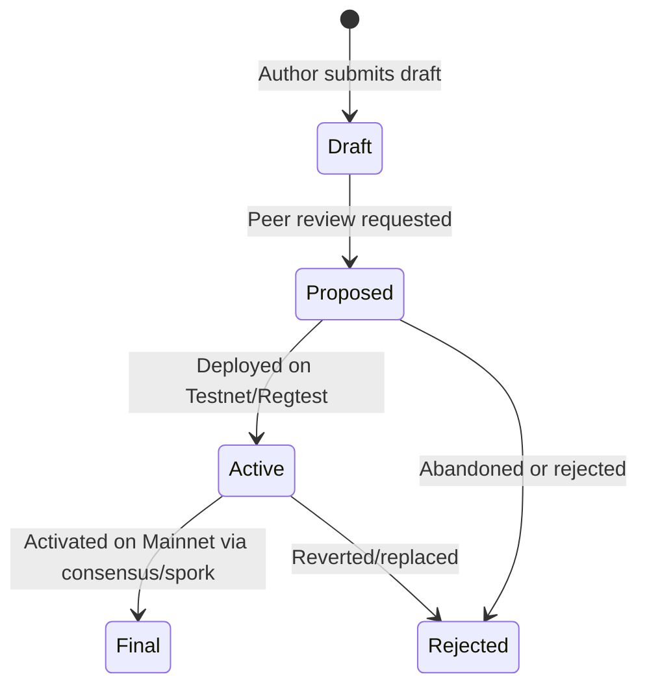

```
KTIP: 0001
Title: KTIP Process
Author: KristaTech Core Developers
Status: Active
Type: Process
Created: 2026-06-16
```

## Abstract
This document defines the KristaTech Improvement Proposal (KTIP) process. A KTIP is a design document providing information to the KristaTech community, or describing a new feature for KristaTech or its processes or environment.

## Motivation
KristaTech requires a standardized, transparent, and structured process for introducing, discussing, and documenting network improvements, protocol modifications, and consensus upgrades. By establishing the KTIP process, we ensure that technical specifications are detailed, backward compatibility is evaluated, and implementation details are archived for developers and network participants.

## KTIP Types
We classify KTIPs into three distinct categories:
1. **Standard Track**: Any change that affects the core protocol, block validation rules, consensus parameters, cryptographic primitives, P2P network serialization, or RPC interface.
2. **Informational**: Guidelines, design patterns, or general information relevant to the ecosystem, developers, and mining pools.
3. **Process**: Proposals to alter the development workflow, code compilation guidelines, continuous integration pipeline, or documentation structures.

## KTIP Lifecycle
A KTIP transitions through the following states during its lifetime:



* **Draft**: The proposal is in progress and actively edited by the authors.
* **Proposed**: The proposal is complete, formally submitted, and undergoing review by core developers and the community.
* **Active**: The proposal has been approved and its implementation is deployed and testing on the Testnet and Regtest environments.
* **Final**: The proposal has been successfully activated on Mainnet, either through a specific block height consensus trigger or a Spork activation.
* **Rejected**: The proposal is closed without activation, either due to security flaws, lack of consensus, or replacement by a superior proposal.

## Document Template
Every KTIP must begin with a metadata header block (enclosed in a text block) and contain the following structured sections:
1. **Abstract**: A concise technical summary of the proposed change (under 200 words).
2. **Motivation**: The rationale explaining why the current protocol is insufficient and why the upgrade is necessary.
3. **Specification**: The exact technical details of the proposal, including mathematical formulas, data structures, state machines, and consensus parameters.
4. **Backward Compatibility**: An evaluation of the upgrade's impact on legacy nodes (e.g., Soft Fork, Hard Fork, or Spork-controlled).
5. **Reference Implementation**: Links to the pull requests, commits, or source code files implementing the specification.
