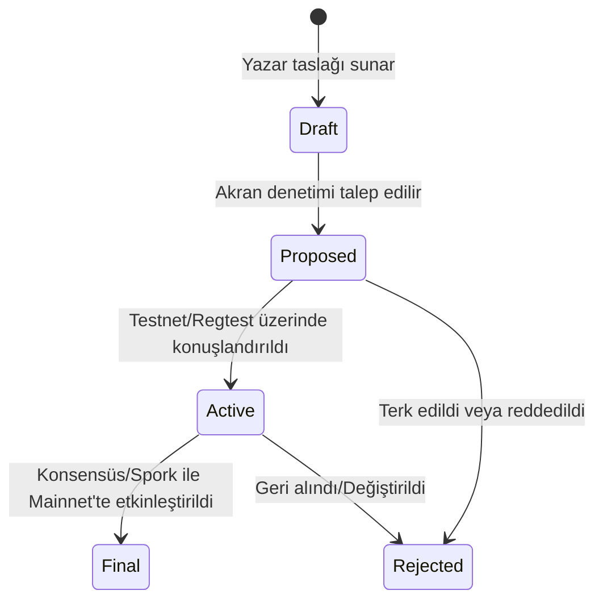

```
KTIP: 0001
Başlık: KTIP Süreci (KTIP Process)
Yazar: KristaTech Core Developers
Durum: Active
Tür: Process
Oluşturulma Tarihi: 2026-06-16
```

## Özet
Bu belge, KristaTech İyileştirme Önerisi (KTIP) sürecini tanımlamaktadır. Bir KTIP; KristaTech topluluğuna bilgi sağlayan, KristaTech için yeni bir özelliği, süreçlerini veya ortamını açıklayan bir tasarım belgesidir.

## Motivasyon
KristaTech; ağ iyileştirmelerini, protokol değişikliklerini ve konsensüs güncellemelerini tanıtmak, tartışmak ve belgelemek için standartlaştırılmış, şeffaf ve yapılandırılmış bir sürece ihtiyaç duyar. KTIP sürecini kurarak, teknik özelliklerin ayrıntılı bir şekilde sunulmasını, geriye dönük uyumluluğun değerlendirilmesini ve uygulama ayrıntılarının geliştiriciler ile ağ katılımcıları için arşivlenmesini sağlıyoruz.

## KTIP Türleri
KTIP'leri üç farklı kategoride sınıflandırıyoruz:
1. **Standart Yolda (Standard Track)**: Çekirdek protokolü, blok doğrulama kurallarını, konsensüs parametrelerini, kriptografik ilkelere (primitives), P2P ağ serileştirmesini veya RPC arayüzünü etkileyen her türlü değişiklik.
2. **Bilgilendirici (Informational)**: Ekosistem, geliştiriciler ve madencilik havuzları için yararlı yönergeler, tasarım şablonları veya genel bilgiler.
3. **Süreç (Process)**: Geliştirme iş akışını, kod derleme yönergelerini, sürekli entegrasyon (CI) hattını veya belgelendirme yapılarını değiştirmeye yönelik öneriler.

## KTIP Yaşam Döngüsü
Bir KTIP, ömrü boyunca aşağıdaki durumlardan geçer:



* **Taslak (Draft)**: Öneri hazırlık aşamasındadır ve yazarlar tarafından aktif olarak düzenlenmektedir.
* **Önerilen (Proposed)**: Öneri tamamlanmış, resmi olarak sunulmuş ve çekirdek geliştiriciler ile topluluk tarafından inceleme sürecindedir.
* **Aktif (Active)**: Öneri onaylanmış ve uygulaması Testnet ve Regtest ortamlarında test edilmek üzere devreye alınmıştır.
* **Nihai (Final)**: Öneri, belirli bir blok yüksekliği konsensüs tetikleyicisi veya bir Spork etkinleştirmesi aracılığıyla Mainnet üzerinde başarıyla etkinleştirilmiştir.
* **Reddedildi (Rejected)**: Güvenlik açıkları, fikir birliği eksikliği veya daha üstün bir öneriyle değiştirilmesi nedeniyle öneri etkinleştirilmeden kapatılmıştır.

## Belge Şablonu
Her KTIP, bir üst bilgi bloğu ile başlamalı (bir metin bloğu içinde) ve aşağıdaki yapılandırılmış bölümleri içermelidir:
1. **Abstract (Özet)**: Önerilen değişikliğin kısa bir teknik özeti (200 kelimenin altında).
2. **Motivation (Motivasyon)**: Mevcut protokolün neden yetersiz olduğunu ve güncellemenin neden gerekli olduğunu açıklayan gerekçe.
3. **Specification (Teknik Özellikler)**: Matematiksel formüller, veri yapıları, durum makineleri ve konsensüs parametreleri dahil olmak üzere önerinin kesin teknik ayrıntıları.
4. **Backward Compatibility (Geriye Dönük Uyumluluk)**: Güncellemenin eski düğümler üzerindeki etkisinin değerlendirilmesi (örn. Soft Fork, Hard Fork veya Spork kontrollü).
5. **Reference Implementation (Referans Uygulama)**: Spesifikasyonu uygulayan pull request'lere, commit'lere veya kaynak kod dosyalarına bağlantılar.
