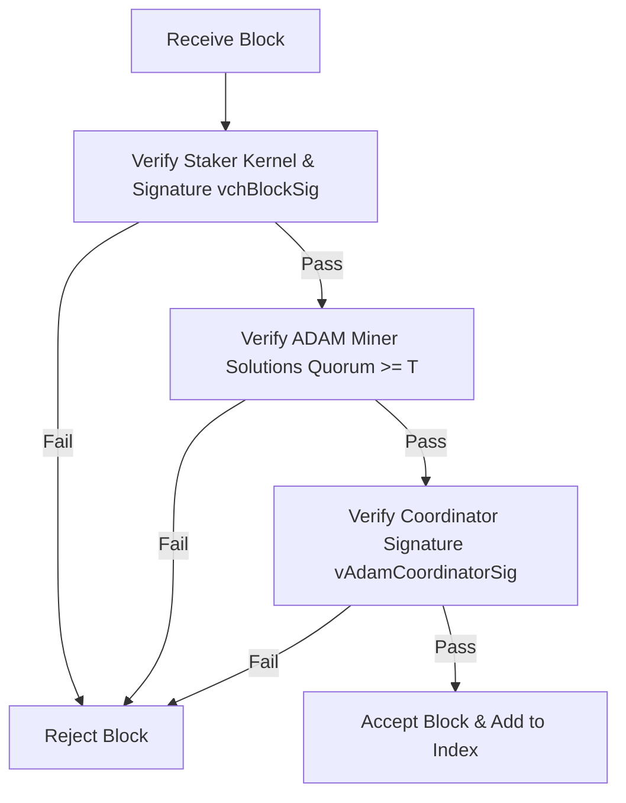

```
KTIP: 0004
Title: PoMBL (Proof of Masternode and Block Lock) Dual-Signature Validation
Author: KristaTech Core Developers
Status: Active
Type: Standard Track (Consensus)
Created: 2026-06-16
```

## Abstract
This proposal specifies **PoMBL (Proof of Masternode and Block Lock)**, the dual-signature consensus validation rule implemented in the KRISTA network. PoMBL mandates that every block generated after the Proof-of-Stake (PoS) upgrade height must be locked under two distinct signature types: the staker's signature (`vchBlockSig`) and the elected ADAM Coordinator's signature (`vAdamCoordinatorSig`). Any block missing either signature or containing invalid signatures is strictly rejected by consensus validation rules.

## Motivation
In standard Proof-of-Stake networks, block production is determined solely by the private key of the winning staking wallet. This model suffers from:
1. **Selfish Staking**: Staking wallets can withhold blocks to build secret chains.
2. **Validator Bribery & Target DoS**: Since the upcoming validators can be known or predicted, they are targets for network attacks or bribery.
3. **Nothing-at-Stake**: Signing block headers on multiple forks is costless.

PoMBL resolves these problems by forcing stakers to acquire validation locking from the dynamically elected ADAM Coordinator before a block can be broadcast.

## Specification

### 1. Dual-Signature Structure
Every block header (`CBlockHeader` in `src/primitives/block.h`) must contain two independent cryptographic signature fields when block height $\ge 200$ (activation of PoS upgrade):

* `vchBlockSig`: The legacy Proof-of-Stake signature, generated by the staker using the private key corresponding to the coin-stake input UTXO. It signs the final block header hash.
* `vAdamCoordinatorSig`: The coordinator signature, generated by the elected ADAM Coordinator using the hybrid BLS12-381 + ECDSA fallback signature scheme. It signs the block header hash *excluding the coordinator signature itself and the LLMQ signature share if present*.

---

### 2. Validation Rules
When a block is processed by validating nodes (`CheckBlock()` in `src/main.cpp`), the following validation sequence is enforced:

#### A. Proof-of-Stake Verification
1. Verify the `coinstake` transaction structure.
2. Verify the staking kernel hash matches target difficulty:

   $$\text{kernelHash} \le W_{\text{total}} \times \text{Target}$$

3. Verify the staker's block signature `vchBlockSig` against the public key of the winning coinstake UTXO.

---

#### B. ADAM Quorum Verification
1. Query the elected miners list for the block height via `SelectAdamNodes()`.
2. Verify that `vAdamSolutions` size matches the elected miner count.
3. Loop through `vAdamSolutions` and count valid, non-empty, signed partial PoW solutions.
4. Verify that the count of valid solutions meets or exceeds the required consensus threshold ($T$):
   - **Mainnet / Regtest**: $T \ge 7$ solutions.
   - **Testnet**: $T \ge 3$ solutions.
5. Verify the miner signatures inside each non-empty solution against the corresponding elected miner's public key.

---

#### C. Coordinator Signature Verification
1. Query the elected Coordinator's public key for the block height via `SelectAdamNodes()`.
2. Compute the block header hash excluding `vAdamCoordinatorSig` (and `vQuorumSig` in Version 12).
3. Verify that `vAdamCoordinatorSig` is a valid signature matching the expected Coordinator's public key signing the computed block header hash using `VerifyBLSWithECDSAFallback()`.

---

### 3. Consensus Enforcement
If any of the verification steps (PoS, ADAM Quorum, or Coordinator Signature) fail, the block is rejected with a `bad-cb-sig` or consensus violation error. Single-signature blocks are strictly invalid.



## Backward Compatibility
* PoMBL validation rules are activated at block height `200` on Mainnet, Testnet, and Regtest (`Consensus::UPGRADE_POS`).
* Blocks prior to height 200 are pure PoW blocks and do not enforce PoS kernel verification or double-signatures.

## Reference Implementation
* Block primtive class extensions: `src/primitives/block.h` and `src/primitives/block.cpp`.
* Staker block signing: `SignBlock()` in `src/wallet/wallet.cpp`.
* Validation rules: `CheckBlock()` and `ContextualCheckBlockHeader()` in `src/main.cpp`.
