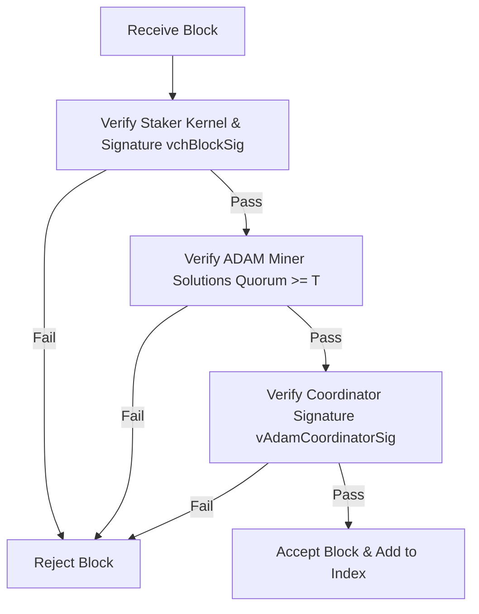

```
KTIP: 0004
Başlık: PoMBL Çift İmza Doğrulama Kuralları (PoMBL Dual-Signature Validation)
Yazar: KristaTech Core Developers
Durum: Active
Tür: Standard Track (Consensus)
Oluşturulma Tarihi: 2026-06-16
```

## Özet
Bu öneri, KRISTA ağında uygulanan **PoMBL (Proof of Masternode and Block Lock)** çift imza doğrulama kuralını tanımlamaktadır. PoMBL, Proof-of-Stake (PoS) yükseltme yüksekliğinden sonra üretilen her blokun iki farklı imza türü altında kilitlenmesini zorunlu kılar: stake edenin imzası (`vchBlockSig`) ve seçilen ADAM Koordinatörünün imzası (`vAdamCoordinatorSig`). İmzası eksik olan veya geçersiz imza içeren herhangi bir blok konsensüs doğrulama kuralları tarafından kesin bir şekilde reddedilir.

## Motivasyon
Standart Proof-of-Stake ağlarında, blok üretimi yalnızca kazanan staker cüzdanının gizli anahtarı tarafından belirlenir. Bu model aşağıdaki sorunlara yol açar:
1. **Bencil Staking (Selfish Staking)**: Staker cüzdanlarının gizli zincirler oluşturmak için blokları saklaması.
2. **Onaylayıcı Rüşveti ve Hedefli DoS**: Sıradaki onaylayıcılar önceden bilinebildiği veya tahmin edilebildiği için, ağ saldırılarının veya rüşvet girişimlerinin hedefi haline gelirler.
3. **Nothing-at-Stake**: Rakip birden fazla çatallanma (fork) üzerinde blok başlığı imzalamanın maliyetsiz olması.

PoMBL, staker'ları bir blok yayılmadan önce dinamik olarak seçilen ADAM Koordinatöründen doğrulama kilidi almaya zorlayarak bu sorunları çözer.

## Teknik Özellikler

### 1. Çift İmza Yapısı
Blok yüksekliği $\ge 200$ (PoS yükseltmesinin etkinleştirilmesi) olduğunda her blok başlığı (`src/primitives/block.h` içindeki `CBlockHeader`) iki bağımsız kriptografik imza alanı içermelidir:

* `vchBlockSig`: Kazanan coin-stake girdi UTXO'sunun gizli anahtarı kullanılarak staker tarafından oluşturulan geleneksel Proof-of-Stake imzası. Nihai blok başlığı hash değerini imzalar.
* `vAdamCoordinatorSig`: Belirlenimci hibrit BLS12-381 + ECDSA fallback imza şeması kullanılarak seçilen ADAM Koordinatörü tarafından oluşturulan koordinatör imzası. *Koordinatör imzasının kendisi ve varsa Versiyon 12'deki LLMQ imza payı hariç tutularak* hesaplanan blok başlığı hash değerini imzalar.

---

### 2. Doğrulama Kuralları
Bir blok doğrulayıcı düğümler tarafından işlendiğinde (`src/main.cpp` içindeki `CheckBlock()`), aşağıdaki doğrulama sırası zorunlu kılınır:

#### A. Proof-of-Stake Doğrulaması
1. `coinstake` işleminin yapısını doğrulayın.
2. Staking kernel hash değerinin hedef zorluğu karşıladığını doğrulayın:

   $$\text{kernelHash} \le W_{\text{total}} \times \text{Target}$$

3. Stake edenin blok imzasını (`vchBlockSig`), kazanan coinstake UTXO'sunun açık anahtarına karşı doğrulayın.

---

#### B. ADAM Quorum Doğrulaması
1. `SelectAdamNodes()` aracılığıyla o blok yüksekliği için seçilen madenciler listesini sorgulayın.
2. `vAdamSolutions` boyutunun seçilen madenci sayısıyla eşleştiğini doğrulayın.
3. `vAdamSolutions` dizisi üzerinde döngü gerçekleştirerek geçerli, boş olmayan, imzalı kısmi PoW çözümlerini sayın.
4. Geçerli çözümlerin sayısının gerekli konsensüs eşiğini ($T$) karşıladığını doğrulayın:
   - **Mainnet / Regtest**: $T \ge 7$ çözüm.
   - **Testnet**: $T \ge 3$ çözüm.
5. Boş olmayan her bir çözümdeki madenci imzalarını, seçilen ilgili madencinin açık anahtarına karşı doğrulayın.

---

#### C. Koordinatör İmzası Doğrulaması
1. `SelectAdamNodes()` aracılığıyla o blok yüksekliği için seçilen Koordinatörün açık anahtarını sorgulayın.
2. `vAdamCoordinatorSig` (ve Versiyon 12'de `vQuorumSig`) hariç tutularak blok başlığı hash değerini hesaplayın.
3. `vAdamCoordinatorSig` imzasının, `VerifyBLSWithECDSAFallback()` kullanılarak hesaplanan blok başlığı hash değerini imzalayan beklenen Koordinatörün açık anahtarıyla eşleşen geçerli bir imza olduğunu doğrulayın.

---

### 3. Konsensüs Dayatması
Doğrulama adımlarından herhangi biri (PoS, ADAM Quorumu veya Koordinatör İmzası) başarısız olursa, blok bir `bad-cb-sig` veya konsensüs ihlali hatası ile reddedilir. Tek imzalı bloklar kesinlikle geçersizdir.



## Geriye Dönük Uyumluluk
* PoMBL doğrulama kuralları; Mainnet, Testnet ve Regtest üzerinde `200`. blok yüksekliğinde etkinleşir (`Consensus::UPGRADE_POS`).
* 200. blok yüksekliğinden önceki bloklar saf PoW bloklarıdır ve PoS kernel doğrulamasını ya da çift imzaları zorunlu kılmaz.

## Referans Uygulama
* Blok ilkel (primitive) sınıf genişletmeleri: `src/primitives/block.h` ve `src/primitives/block.cpp`.
* Staker blok imzalama: `src/wallet/wallet.cpp` içindeki `SignBlock()`.
* Doğrulama kuralları: `src/main.cpp` içindeki `CheckBlock()` ve `ContextualCheckBlockHeader()`.
