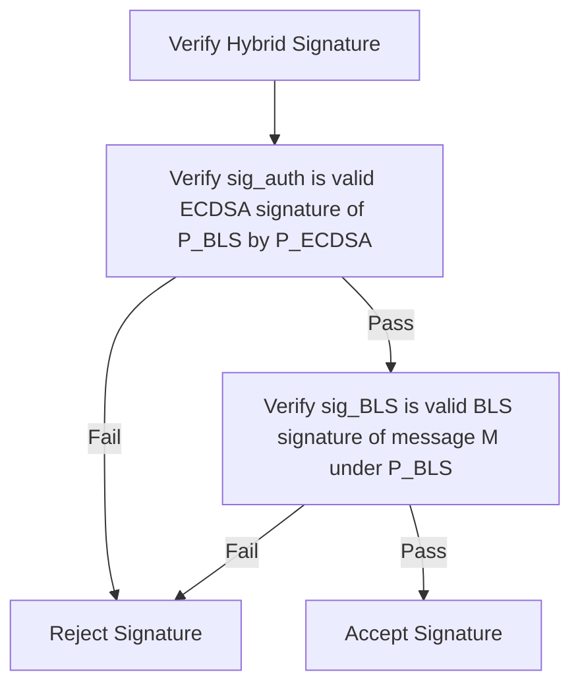

```
KTIP: 0005
Title: PoBLS (Proof of BLS) Hybrid ECDSA/BLS12-381 Signature Consensus
Author: KristaTech Core Developers
Status: Active
Type: Standard Track (Consensus)
Created: 2026-06-16
```

## Abstract
This proposal specifies **PoBLS (Proof of BLS)**, the hybrid ECDSA/BLS12-381 cryptographic authorization and signature mechanism implemented in the KRISTA network. PoBLS allows validator nodes to perform deterministic signing operations (such as block coordinator signatures and VRF seed proofs) using the BLS12-381 curve while maintaining identity binding and compatibility with the network's standard secp256k1 (ECDSA) address infrastructure.

## Motivation
In standard cryptographic consensus:
1. **ECDSA Signatures** (on the secp256k1 curve) are non-deterministic (without RFC 6979) and do not support signature aggregation, making them unsuitable for scalable quorums or unpredictable Verifiable Random Functions (VRFs) where grinding must be prevented.
2. **BLS12-381 Signatures** are deterministic and pairing-friendly, making them ideal for VRFs and aggregate signatures.
3. However, the KRISTA network's identity layers, wallets, and masternode registrations are built on secp256k1.

PoBLS bridges these two curves by implementing a dual-signature authorization scheme that proves authorization of a BLS key via an ECDSA signature, and validates messages via a BLS signature.

## Specification

### 1. Key Derivation and Pairing
Every active validator (Masternode or registered miner) possesses a standard secp256k1 private key $s_{\text{ECDSA}}$ and public key $P_{\text{ECDSA}}$.

To participate in PoBLS consensus:
1. The node derives a BLS12-381 private key $s_{\text{BLS}}$ deterministically by hashing its ECDSA private key:

   $$s_{\text{BLS}} = \text{SHA-256}(s_{\text{ECDSA}})$$

2. The corresponding BLS12-381 public key $P_{\text{BLS}}$ is calculated as a point on the G1 group:

   $$P_{\text{BLS}} = s_{\text{BLS}} \times G_1$$

   Where $G_1$ is the generator of the G1 group on the BLS12-381 curve.

3. To bind the derived BLS public key to the node's secp256k1 identity and prevent public key spoofing attacks, the node signs the derived $P_{\text{BLS}}$ using its secp256k1 private key:

   $$\text{sig}_{\text{auth}} = \text{Sign}_{\text{ECDSA}}(P_{\text{BLS}}, s_{\text{ECDSA}})$$

   This results in an authorization proof that binds the $P_{\text{BLS}}$ public key to the owner of $P_{\text{ECDSA}}$.

---

### 2. Message Signing
When signing a message $M$ (such as a block header hash or the previous VRF rolling seed):
1. The node generates a BLS12-381 signature $\text{sig}_{\text{BLS}}$ on the G2 group:

   $$\text{sig}_{\text{BLS}} = \text{Sign}_{\text{BLS}}(M, s_{\text{BLS}})$$

2. The resulting hybrid signature payload consists of the tuple:

   $$\text{HybridSignature} = \left(\text{sig}_{\text{BLS}}, P_{\text{BLS}}, \text{sig}_{\text{auth}}\right)$$

---

### 3. Verification Protocol (`VerifyBLSWithECDSAFallback`)
When validating a hybrid signature against the expected validator's secp256k1 public key $P_{\text{ECDSA}}$:



1. **Step 1: Authorization Check**:
   Verify that $\text{sig}_{\text{auth}}$ is a valid secp256k1 ECDSA signature signing the bytes of $P_{\text{BLS}}$ using the public key $P_{\text{ECDSA}}$.
   If this check fails, the verification aborts and returns `false`. This prevents an attacker from generating a valid BLS signature using a public key they created but did not authorize with the node's identity key.

2. **Step 2: BLS Verification**:
   Verify that $\text{sig}_{\text{BLS}}$ is a valid BLS12-381 signature of the message $M$ using the public key $P_{\text{BLS}}$.
   The signature is verified via pairing:

   $$e(\text{sig}_{\text{BLS}}, G_1) == e(H_2(M), P_{\text{BLS}})$$

   Where $H_2(M)$ is the hash-to-curve function mapping the message to a point on the G2 group, and $e$ is the bilinear pairing operator.

If both checks pass, the hybrid signature is valid.

## Backward Compatibility
* PoBLS signatures are mandatory for VRF proofs (`vAdamVRFProof`) and Coordinator signatures (`vAdamCoordinatorSig`) in all Version 11 and Version 12 blocks (starting at block height `200`).
* Legacy block hashes prior to height 200 do not utilize PoBLS.

## Reference Implementation
* Derivation and hybrid signature routines: `src/bls/bls_fallback.cpp` and `src/bls/bls_fallback.h`.
* VRF proof serialization and verification: `src/adam.cpp`.
