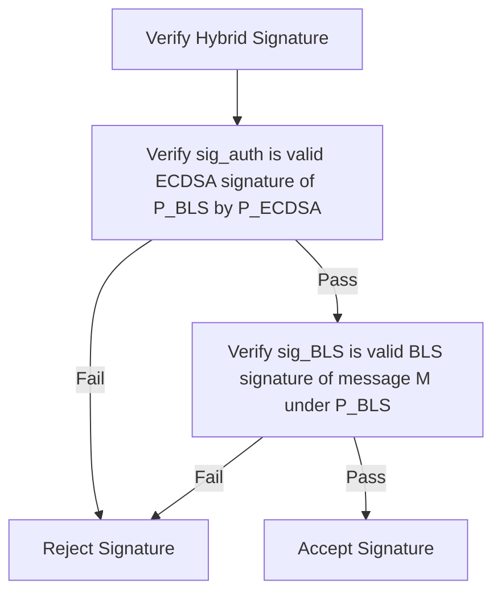

```
KTIP: 0005
Title: PoBLS (Proof of BLS) Hibrit ECDSA/BLS12-381 İmza Konsensüsü
Author: KristaTech Core Developers
Status: Active
Type: Standard Track (Consensus)
Created: 2026-06-16
```

## Özet
Bu teklif, KRISTA ağında uygulanan hibrit ECDSA/BLS12-381 kriptografik yetkilendirme ve imza mekanizması olan **PoBLS (Proof of BLS)** protokolünü tanımlamaktadır. PoBLS, doğrulayıcı düğümlerin (validator nodes), ağın standart secp256k1 (ECDSA) adres altyapısıyla kimlik bağını ve uyumluluğunu korurken, BLS12-381 eğrisini kullanarak deterministik imzalama işlemlerini (blok koordinatör imzaları ve VRF seed kanıtları gibi) gerçekleştirmesine olanak tanır.

## Motivasyon
Standart kriptografik konsensüste:
1. **ECDSA İmzaları** (secp256k1 eğrisi üzerinde) deterministik değildir (RFC 6979 kullanılmadığında) ve imza birleştirmeyi (signature aggregation) desteklemez. Bu durum, onları ölçeklenebilir quorum'lar veya grinding (manipülasyon) saldırılarının önlenmesi gereken öngörülemez Doğrulanabilir Rastgele Fonksiyonlar (VRF) için elverişsiz kılar.
2. **BLS12-381 İmzaları** deterministiktir ve eşleme dostudur (pairing-friendly), bu da onları VRF'ler ve birleşik imzalar için ideal kılar.
3. Ancak, KRISTA ağının kimlik katmanları, cüzdanları ve masternode kayıtları secp256k1 üzerine kuruludur.

PoBLS, bir BLS anahtarının yetkilendirmesini bir ECDSA imzasıyla kanıtlayan ve mesajları bir BLS imzasıyla doğrulayan çift imzalı bir yetkilendirme şeması uygulayarak bu iki eğriyi birleştirir.

## Spesifikasyon

### 1. Anahtar Türetimi ve Eşleme (Pairing)
Her aktif doğrulayıcı (Masternode veya kayıtlı madenci), standart bir secp256k1 özel anahtarına ($s_{\text{ECDSA}}$) ve açık anahtarına ($P_{\text{ECDSA}}$) sahiptir.

PoBLS konsensüsüne katılmak için:
1. Düğüm, kendi ECDSA özel anahtarını hash'leyerek deterministik olarak bir BLS12-381 özel anahtarı ($s_{\text{BLS}}$) türetir:

   $$s_{\text{BLS}} = \text{SHA-256}(s_{\text{ECDSA}})$$

2. Karşılık gelen BLS12-381 açık anahtarı $P_{\text{BLS}}$, G1 grubu üzerinde bir nokta olarak hesaplanır:

   $$P_{\text{BLS}} = s_{\text{BLS}} \times G_1$$

   Burada $G_1$, BLS12-381 eğrisi üzerindeki G1 grubunun üretecidir (generator).

3. Türetilen BLS açık anahtarını düğümün secp256k1 kimliğine bağlamak ve açık anahtar sahteciliği (public key spoofing) saldırılarını önlemek için, düğüm türetilen $P_{\text{BLS}}$ değerini secp256k1 özel anahtarını kullanarak imzalar:

   $$\text{sig}_{\text{auth}} = \text{Sign}_{\text{ECDSA}}(P_{\text{BLS}}, s_{\text{ECDSA}})$$

   Bu işlem, $P_{\text{BLS}}$ açık anahtarını $P_{\text{ECDSA}}$ sahibine bağlayan bir yetkilendirme kanıtı (authorization proof) oluşturur.

---

### 2. Mesaj İmzalama
Bir $M$ mesajı imzalanırken (bir blok başlığı hash'i veya önceki VRF rolling seed'i gibi):
1. Düğüm, G2 grubu üzerinde bir BLS12-381 imzası ($\text{sig}_{\text{BLS}}$) oluşturur:

   $$\text{sig}_{\text{BLS}} = \text{Sign}_{\text{BLS}}(M, s_{\text{BLS}})$$

2. Elde edilen hibrit imza yükü (payload) şu veri grubundan (tuple) oluşur:

   $$\text{HybridSignature} = \left(\text{sig}_{\text{BLS}}, P_{\text{BLS}}, \text{sig}_{\text{auth}}\right)$$

---

### 3. Doğrulama Protokolü (`VerifyBLSWithECDSAFallback`)
Bir hibrit imza, beklenen doğrulayıcının secp256k1 açık anahtarına ($P_{\text{ECDSA}}$) karşı doğrulanırken:



1. **Adım 1: Yetkilendirme Kontrolü**:
   $\text{sig}_{\text{auth}}$ imzasının, $P_{\text{ECDSA}}$ açık anahtarı kullanılarak $P_{\text{BLS}}$ baytlarının imzalandığı geçerli bir secp256k1 ECDSA imzası olduğunu doğrulayın.
   Eğer bu kontrol başarısız olursa, doğrulama durdurulur ve `false` döner. Bu durum, bir saldırganın kendi oluşturduğu fakat düğümün kimlik anahtarı ile yetkilendirmediği bir açık anahtarı kullanarak geçerli bir BLS imzası üretmesini engeller.

2. **Adım 2: BLS Doğrulaması**:
   $\text{sig}_{\text{BLS}}$ imzasının, $P_{\text{BLS}}$ açık anahtarı kullanılarak $M$ mesajının imzalandığı geçerli bir BLS12-381 imzası olduğunu doğrulayın.
   İmza, eşleme (pairing) yöntemiyle doğrulanır:

   $$e(\text{sig}_{\text{BLS}}, G_1) == e(H_2(M), P_{\text{BLS}})$$

   Burada $H_2(M)$, mesajı G2 grubu üzerindeki bir noktaya eşleyen hash-to-curve fonksiyonudur ve $e$ ise bilineer eşleme (bilinear pairing) operatörüdür.

Her iki kontrol de başarıyla tamamlanırsa, hibrit imza geçerlidir.

## Geriye Dönük Uyumluluk
* PoBLS imzaları, blok yüksekliği `200`'den itibaren başlayan tüm Sürüm 11 ve Sürüm 12 bloklarındaki VRF kanıtları (`vAdamVRFProof`) ve Koordinatör imzaları (`vAdamCoordinatorSig`) için zorunludur.
* Yükseklik 200'den önceki eski blok hash'leri PoBLS kullanmaz.

## Referans Uygulama
* Türetme ve hibrit imza rutinleri: `src/bls/bls_fallback.cpp` ve `src/bls/bls_fallback.h`.
* VRF kanıtı serileştirme ve doğrulama: `src/adam.cpp`.
